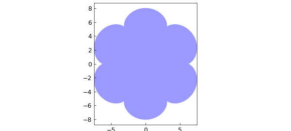
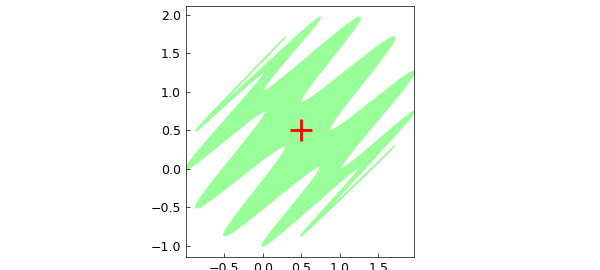
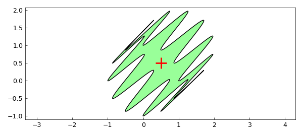

# Area and centroid of a 2D region

*Stefan Guettel, October 2010*

[Original MATLAB Chebfun example](https://www.chebfun.org/examples/geom/Area.html)

Python translation: [`examples/geom/area.py`](https://github.com/ma-gilles/chebfunjax/blob/main/examples/geom/area.py)

With Chebfun it is easy to compute with parametrized curves in the plane. For example, the following lines define a curve $(x,y)$ as a pair of chebfuns in the variable $t$:

```matlab
t = chebfun('t',[0,2*pi]);
b = 1; m = 7; a = (m-1)*b;
x = (a+b)*cos(t) - b*cos((a+b)/b*t);
y = (a+b)*sin(t) - b*sin((a+b)/b*t);
```

Such curves are called epicycloids, named by the Danish astronomer Ole Romer in 1674. Epicycloids can be produced by tracing a point on a circle which rolls out on a larger circle. Romer discovered that cog-wheels with epicycloidal teeth turned with minimum friction. This is what our epicycloid looks like:

```matlab
fill(x,y,[.6 .6 1])
axis equal
```



Note that although this curve is not smooth, the functions $x(t)$ and $y(t)$ that parameterize it are smooth, so Chebfun has no difficulty representing them by global polynomials:

```matlab
x
y
```

```text
epicycloid x: length 53, y: length 52
```

With the following formula we can compute the area enclosed by the curve $(x,y)$:

```matlab
format long
A = sum(x.*diff(y))
```

```text
A =
     1.759291886010285e+02
```

Let's compare this result with the exact area of the epicycloid, given (for integer $m$) by the formula

```matlab
exact = pi*b^2*(m^2+m)
```

```text
exact =
     1.759291886010284e+02
```

Here is a more complicated curve (now defined as a single complex-valued chebfun rather than a pair of real-valued chebfuns):

```matlab
z = exp(1i*t) + (1+1i)*sin(6*t).^2;
fill(real(z),imag(z),[.6 1 .6])
axis equal
```



Because this curve is a perturbed unit circle, with every perturbation occurring twice with opposite signs, the enclosed area should be equal to $\pi$, as is confirmed by Chebfun:

```matlab
A = sum(real(z).*diff(imag(z)));
[ A ; pi ]
```

```text
ans =
   3.141592653589794
   3.141592653589793
centroid = 0.500000 + 0.500000i
```

We can compute and plot the centroid (or center of mass) of this region as follows:

```matlab
c = sum(diff(z).*z.*conj(z))/(2i*A);
hold on
plot(c,'r+','markersize',20)
```



If you use scissors to produce a piece of paper in this shape, it should remain balanced when placed on a vertical needle centered at the red cross. (If it doesn't, it's likely your handicraft precision isn't as good as Chebfun's!)

---

*Translated with [chebfunjax](https://github.com/ma-gilles/chebfunjax); prose and MATLAB code from the original example, copyright The University of Oxford and The Chebfun Developers.  Printed outputs and figures are chebfunjax's.*
