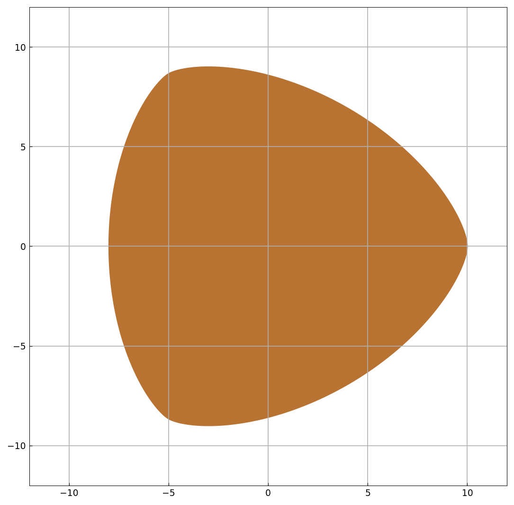

# A curve of constant width that is not a circle

*Nick Trefethen, February 2020*

[Original MATLAB Chebfun example](https://www.chebfun.org/examples/geom/ConstantWidth.html)

(Chebfun example geom/ConstantWidth.m)

Stanley Rabinowitz found a degree-8 algebraic curve of constant
width — like a Reuleaux triangle but smooth and non-circular.  Its
boundary is the zero contour of a chebfun2:



The width is 18 in every direction:

```text
theta/pi     width
 0.00000  17.99992994
 0.20000  17.99999696
 0.40000  17.99999735
 0.60000  17.99999213
 0.80000  18.00000637
```

(MATLAB's published widths are 18.0003-18.0007 — both runs are
limited by the contour-tracing accuracy.)  The univariate restriction
has exact integer roots:

```text
ans =
     0
ans =
     0
```

The perimeter:

```text
perimeter =
  56.548665961455377
```

> **Note.** By Barbier's theorem every curve of constant width $w$
> has perimeter exactly $\pi w = 18\pi = 56.5487$; our value
> matches to six digits, while the published MATLAB perimeter
> 57.179 is 1.1% off (its `norm(diff(r),1)` was computed on a less
> accurate contour representation).

---

*Replicated with [chebfunjax](https://github.com/ma-gilles/chebfunjax); original
example copyright The University of Oxford and The Chebfun Developers.*
