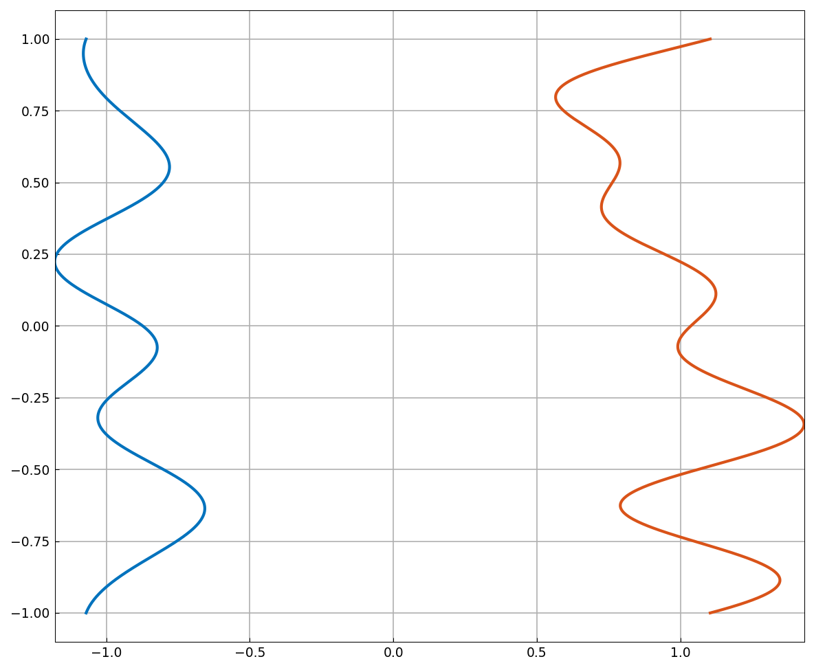
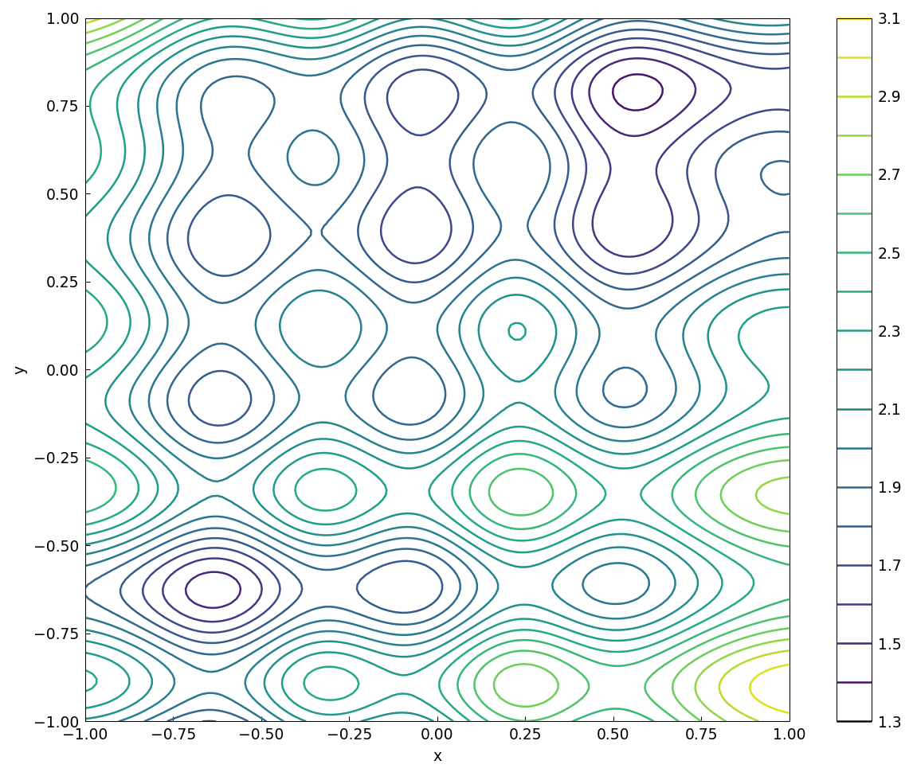
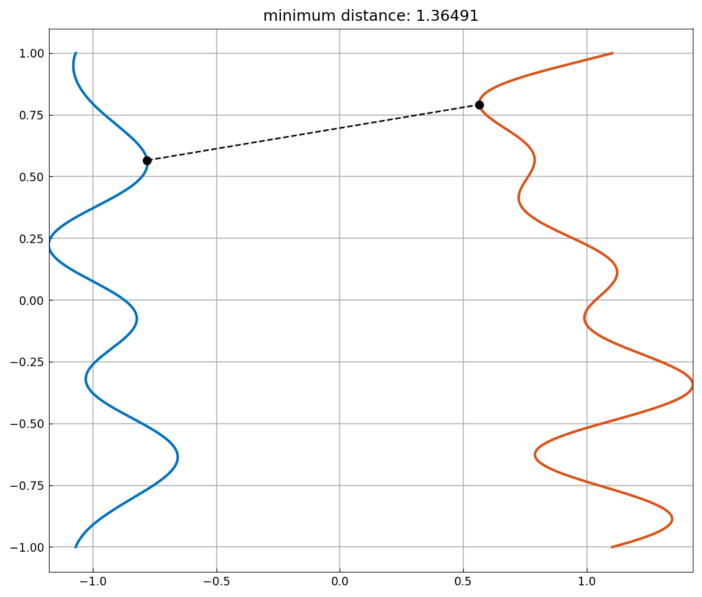

# The minimum distance between two curves

*Nick Trefethen, April 2017*

[Original MATLAB Chebfun example](https://www.chebfun.org/examples/geom/Curves.html)

(Chebfun example geom/Curves.m)

Two random curves in the plane:

The distance $|f(x) - g(y)|$ becomes a chebfun2 of the two curve
parameters:

and its global minimum locates the closest approach:

(`randn` draws are our own; the method is what replicates.)

---

*Replicated with [chebfunjax](https://github.com/ma-gilles/chebfunjax); original
example copyright The University of Oxford and The Chebfun Developers.*
