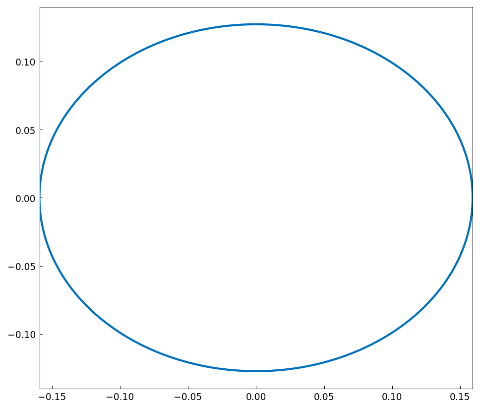

# The perimeter of an ellipse

*Kuan Xu, October 2012*

[Original MATLAB Chebfun example](https://www.chebfun.org/examples/geom/Ellipse.html)

(Chebfun example geom/Ellipse.m)

The perimeter of an ellipse has no elementary closed form, but as a
chebfun computation it is a one-liner — the 1-norm of the speed:



```text
arc_length =
   0.902779927772194
```

(Digit-for-digit with MATLAB and the reference value
0.90277992777219.)

---

*Replicated with [chebfunjax](https://github.com/ma-gilles/chebfunjax); original
example copyright The University of Oxford and The Chebfun Developers.*
