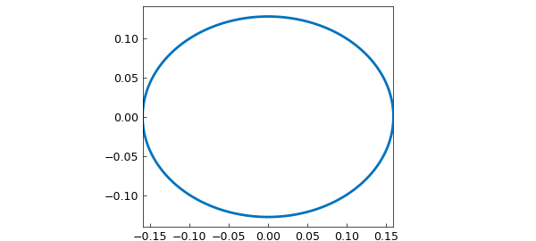

# Perimeter of an ellipse

*Nick Hale and Nick Trefethen, December 2010*

[Original MATLAB Chebfun example](https://www.chebfun.org/examples/geom/Ellipse.html)

Python translation: [`examples/geom/ellipse.py`](https://github.com/ma-gilles/chebfunjax/blob/main/examples/geom/ellipse.py)

The ellipse we use is the one used by Poisson in his paper of 1827 [1], with semiaxis lengths $0.5/\pi$ and $0.4/\pi$. We know thanks to M. Poisson that the perimeter is $0.902779927$ [*].

```matlab
exact = 0.90277992777219;
```

We now attempt to recompute this value using Chebfun.

```matlab
theta = chebfun(@(theta) theta,[0,2*pi]);
x = (0.5/pi)*cos(theta);
y = (0.4/pi)*sin(theta);
plot(x,y,'-','LineWidth',2), axis equal
arc_length = norm(sqrt(diff(x).^2+diff(y).^2),1)
```

```text
arc_length =
   0.902779927772194
exact 0.90277992777219
```



[*] Confusingly Poisson reported this number with a misprint in the 2nd place!

```
       "la valeur approchee de I sera I = 0,9927799272"
```

## References

1. S.-D. Poisson, Sur le calcul numerique des integrales definies, Memoires de L'Academie Royale des Sciences de L'Institut de France 4 (1827), pp. 571-602 (written in 1823).

---

*Translated with [chebfunjax](https://github.com/ma-gilles/chebfunjax); prose and MATLAB code from the original example, copyright The University of Oxford and The Chebfun Developers.  Printed outputs and figures are chebfunjax's.*
