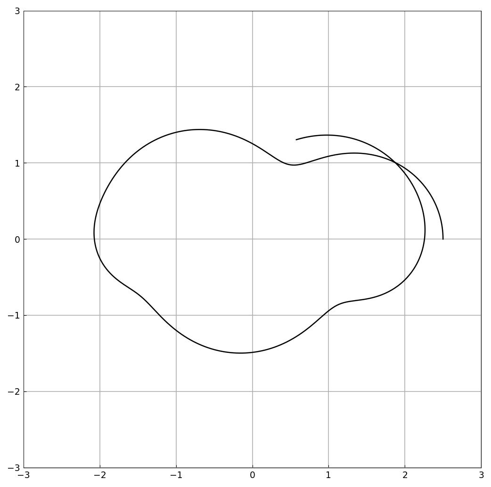
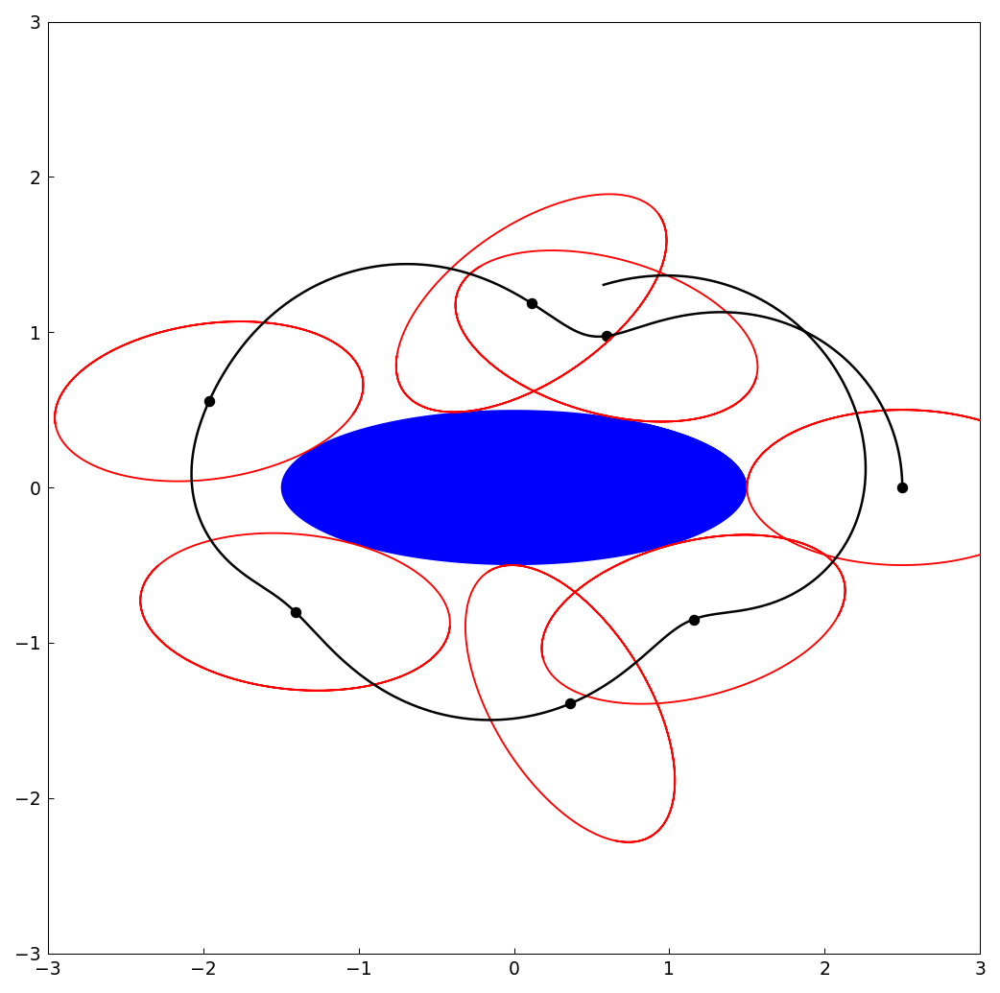

# An ellipse rolling around another ellipse

*Nick Trefethen, December 2015*

[Original MATLAB Chebfun example](https://www.chebfun.org/examples/geom/Ellipses.html)

(Chebfun example geom/Ellipses.m)

Parametrize both ellipses by arc length (an ODE integration), and let
one roll without slipping around the other.  The point of contact
traces the black curve:



The rolling closes up (imaginary part returns to zero) at

```text
tfinal =
   6.781868737250265
trajectory_length =
  11.755625835003425
```

(MATLAB: 6.781868737249928 and 11.755625978672949 — 12 and 8
digits.)  Snapshots of the rolling ellipse:



---

*Replicated with [chebfunjax](https://github.com/ma-gilles/chebfunjax); original
example copyright The University of Oxford and The Chebfun Developers.*
