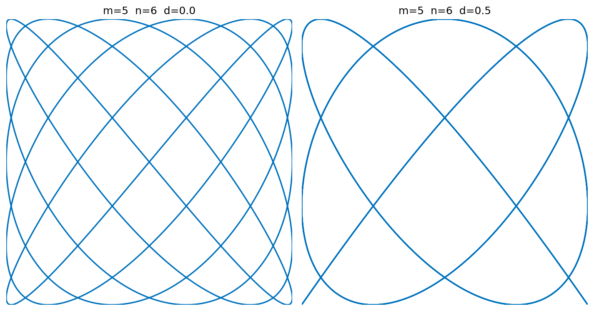
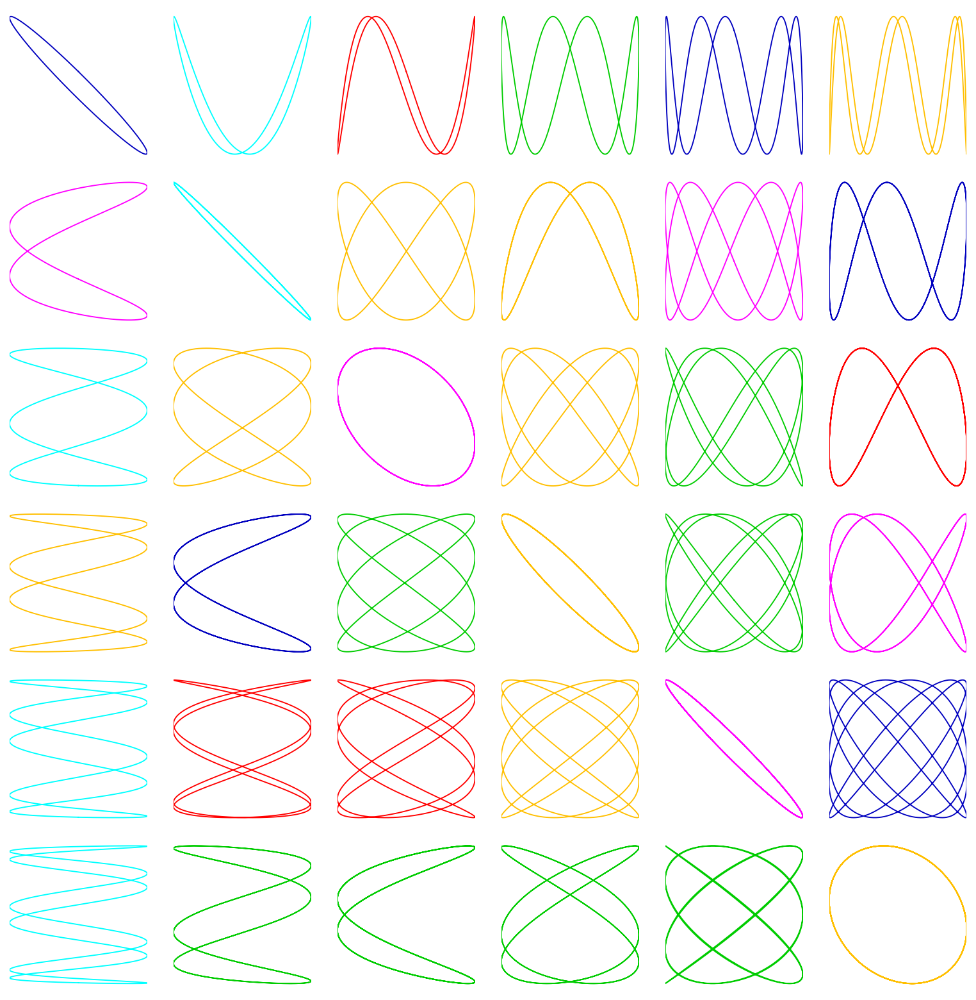

# Lissajous curves

*Nick Trefethen, October 2014*

[Original MATLAB Chebfun example](https://www.chebfun.org/examples/geom/Lissajous.html)

(Chebfun example geom/Lissajous.m)

Lissajous figures are the curves $(\sin mt, \sin(nt + \pi d))$:

A colorful 6x6 garden with random phases:

---

*Replicated with [chebfunjax](https://github.com/ma-gilles/chebfunjax); original
example copyright The University of Oxford and The Chebfun Developers.*
