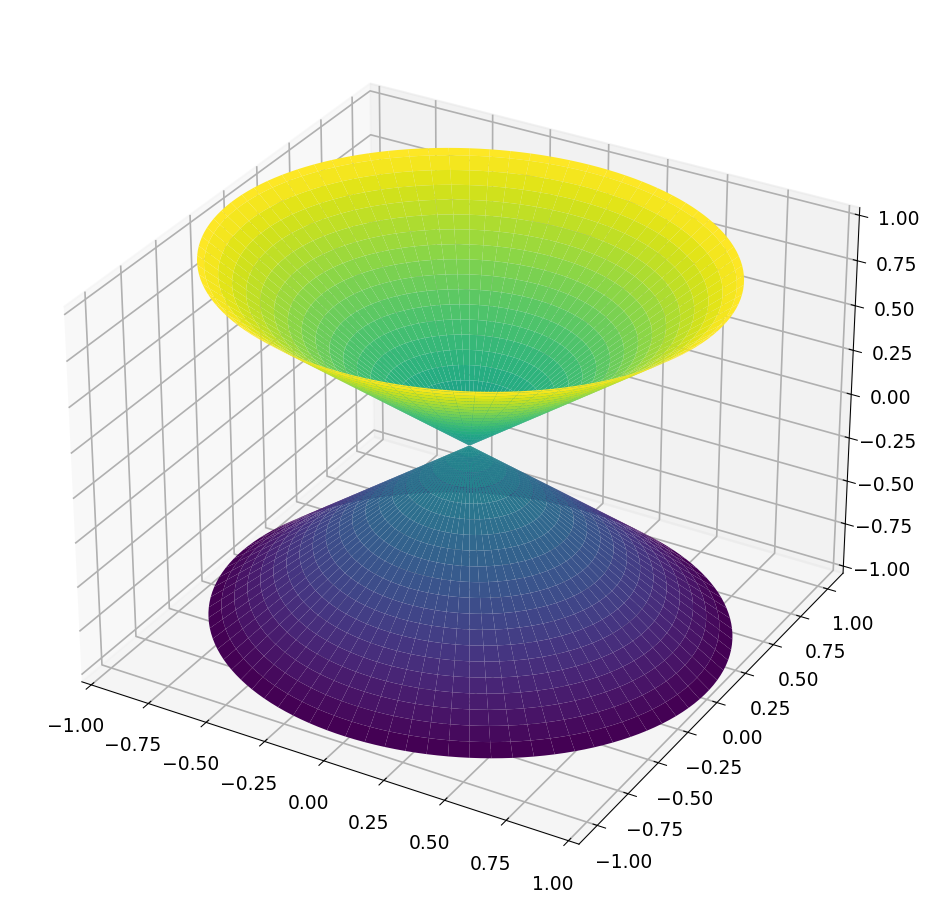
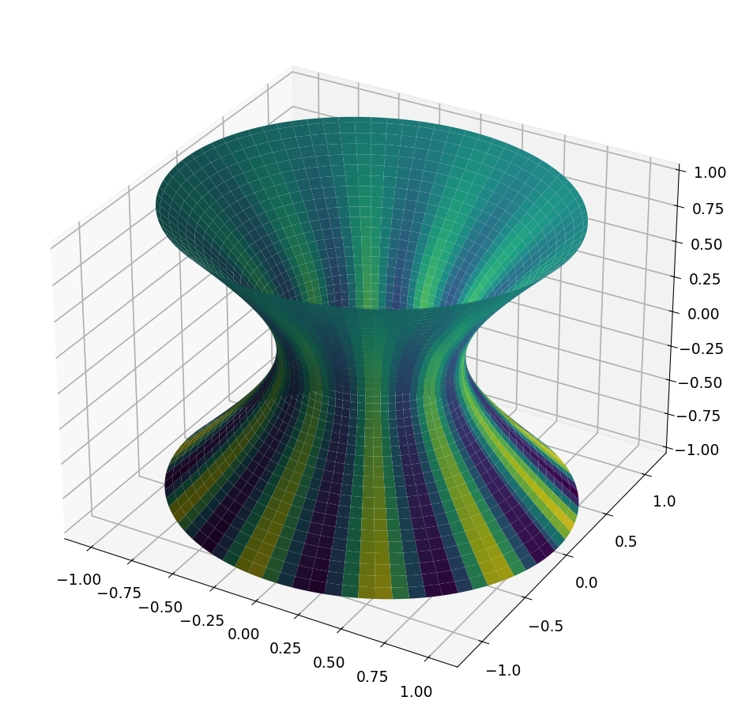
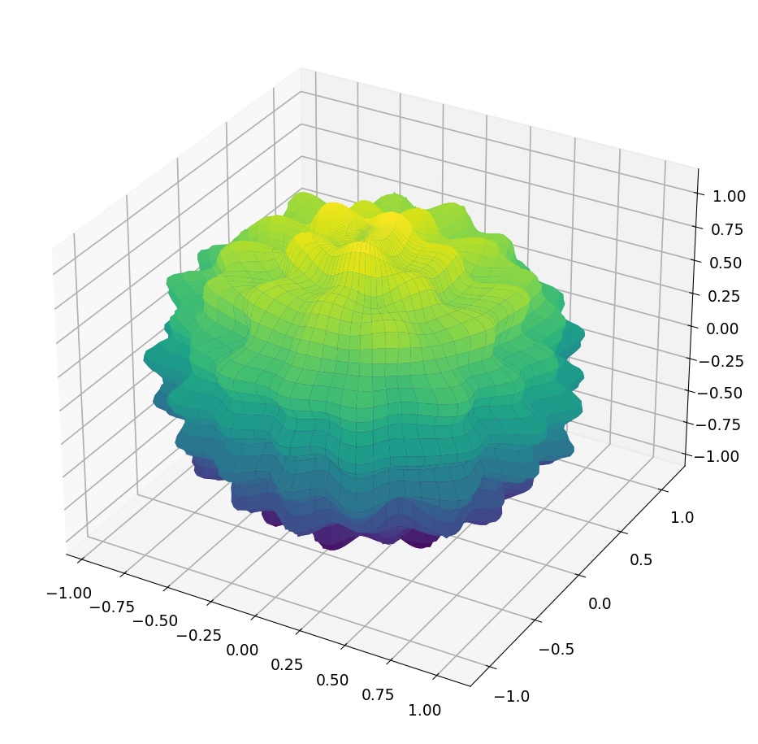
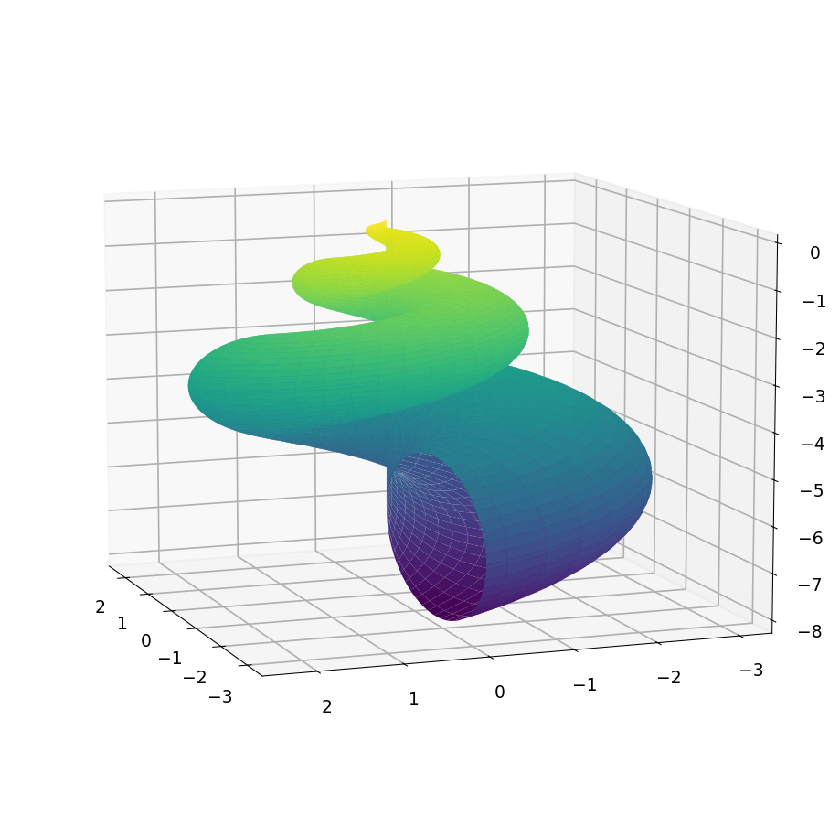
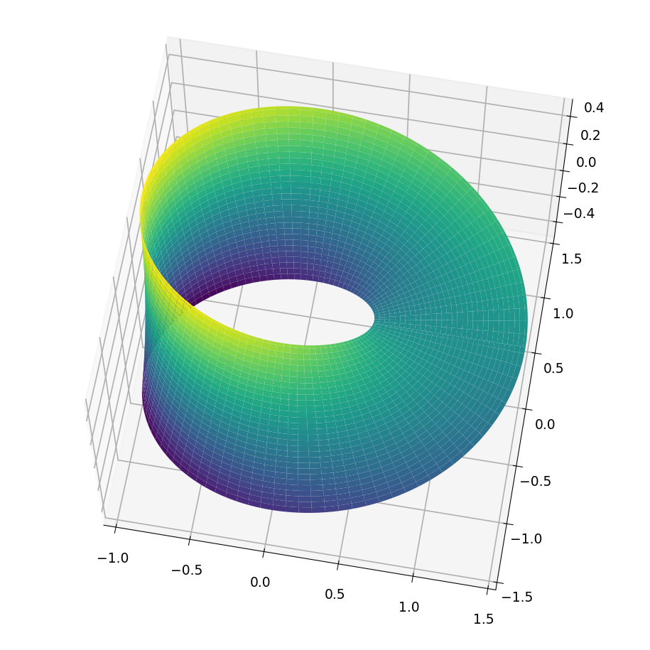
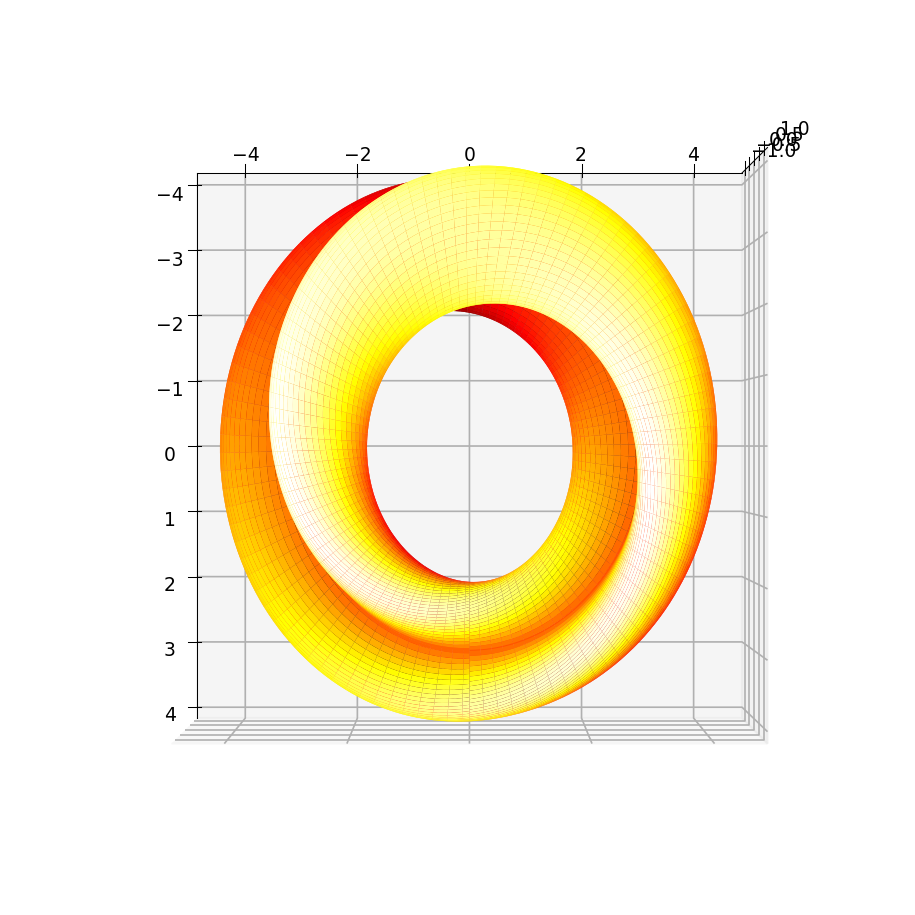

# Parametric surfaces

*Rodrigo Platte, March 2013*

[Original MATLAB Chebfun example](https://www.chebfun.org/examples/geom/ParametricSurfaces.html)

(Chebfun example geom/ParametricSurfaces.m)

Surfaces defined by coordinate functions of two parameters: a cone
and a hyperboloid (with a colored variant):





The sphere, a bumpy perturbation, and a colored one:



A seashell:



A Mobius strip; the tangent vectors $r_u$ and $r_v$ are orthogonal
everywhere:



```text
ans =
     1.318389841742373e-16
```

(MATLAB: 5.0e-14 from chebfun2-differentiated tangents; ours uses
the analytic tangents.)  And a Klein bottle:



---

*Replicated with [chebfunjax](https://github.com/ma-gilles/chebfunjax); original
example copyright The University of Oxford and The Chebfun Developers.*
