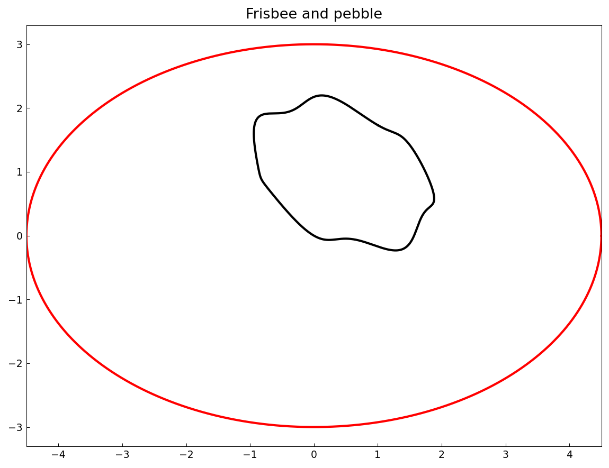
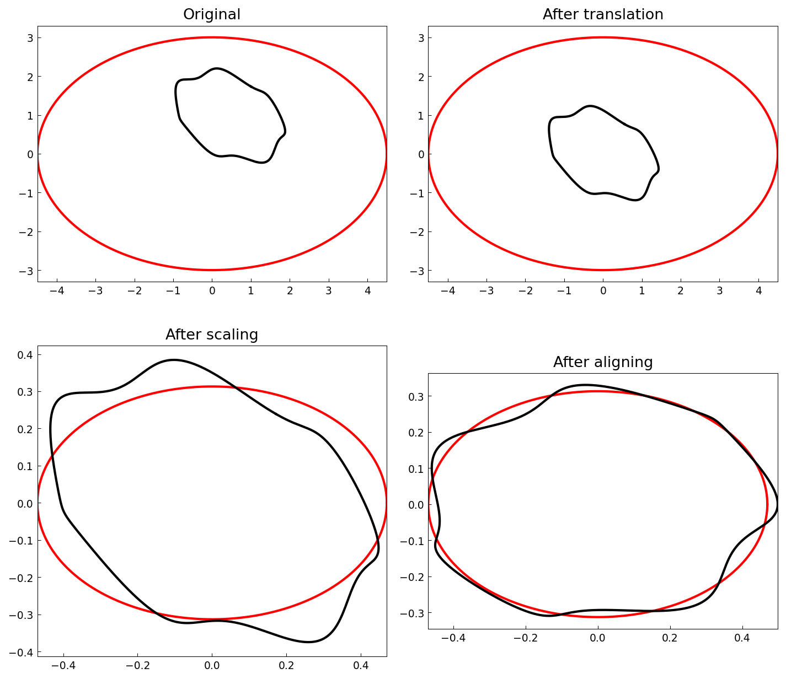
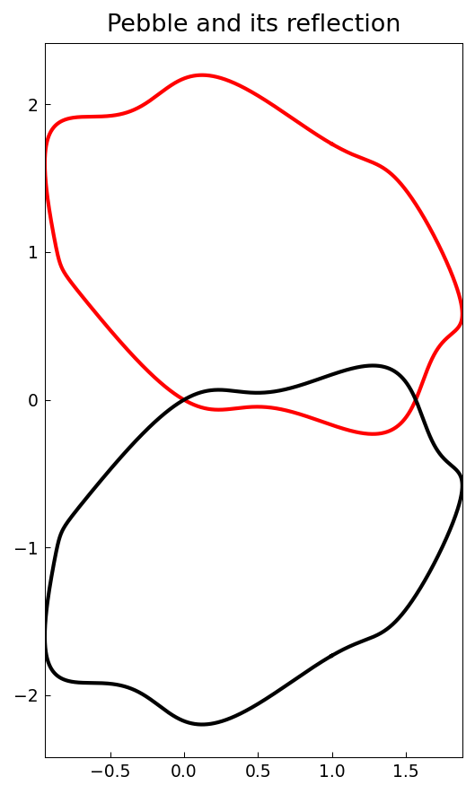
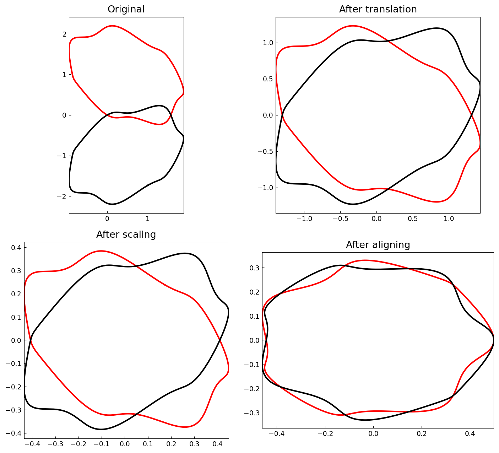

# Procrustes shape analysis

*Alex Townsend, August 2011*

[Original MATLAB Chebfun example](https://www.chebfun.org/examples/geom/Procrustes.html)

(Chebfun example geom/Procrustes.m)

Are these two shapes similar?  Procrustes analysis compares curves
after removing translation, scale, and rotation:





The remaining L2 distance measures true shape difference:

```text
ans =
   0.072321070932181
```

(MATLAB: 0.072348.)  A pebble and its mirror image are NOT related
by translation/scale/rotation, and the distance is larger:





```text
ans =
   0.097511674306527
```

(MATLAB: 0.097594 — the alignment step pivots on an argmax that is
sensitive at this shape's symmetric bumps, so the third digit
differs; the shapes-differ conclusion is identical.)

---

*Replicated with [chebfunjax](https://github.com/ma-gilles/chebfunjax); original
example copyright The University of Oxford and The Chebfun Developers.*
