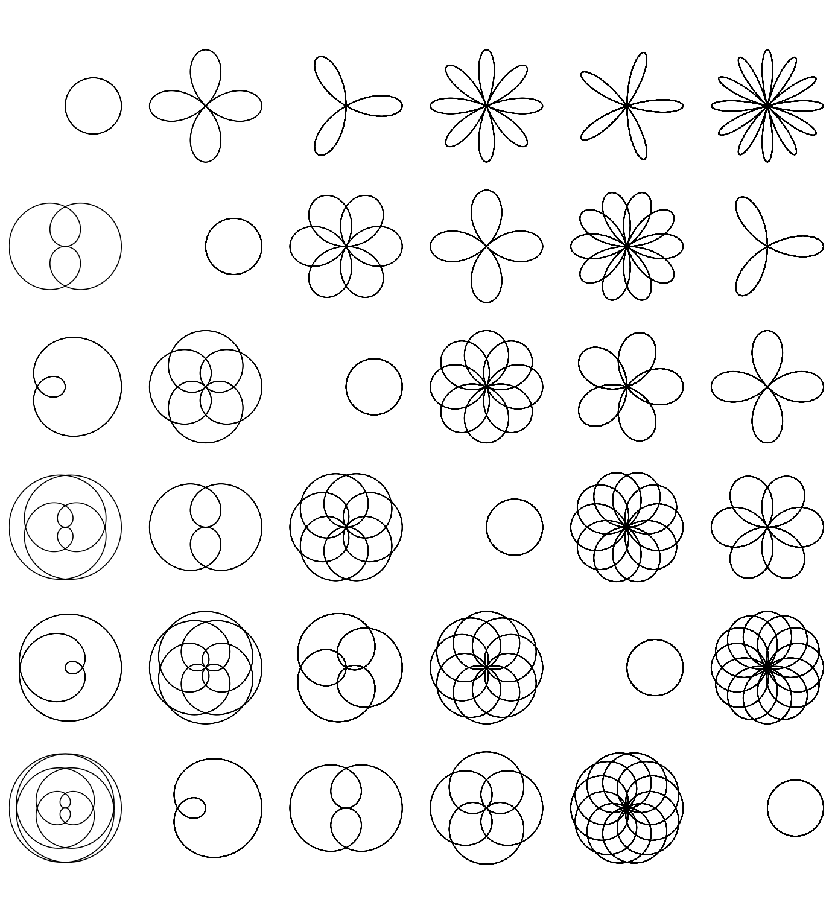

# Rose curves

*Grady Wright, June 2015*

[Original MATLAB Chebfun example](https://www.chebfun.org/examples/geom/RoseCurves.html)

(Chebfun example geom/RoseCurves.m)

Rhodonea curves $\cos(mt/n)e^{it}$ are periodic, so their natural
representation is trigonometric.  The Chebyshev representation of the
same curve is longer by the familiar factor $\pi/2$:

```text
ans =
   1.594000594000594
ans =
   1.570796326794897
```

(MATLAB: 1.5937 — the same $\pi/2$ story.)  A 6x6 garden of roses:



---

*Replicated with [chebfunjax](https://github.com/ma-gilles/chebfunjax); original
example copyright The University of Oxford and The Chebfun Developers.*
