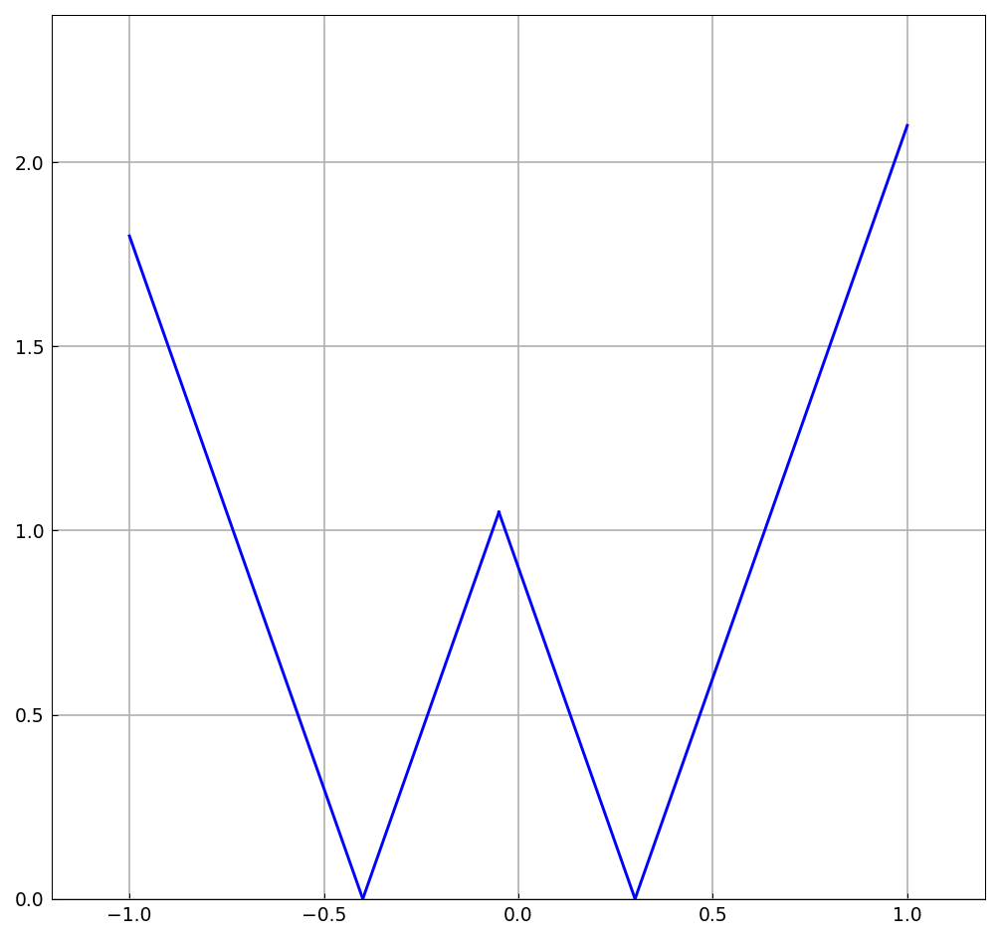
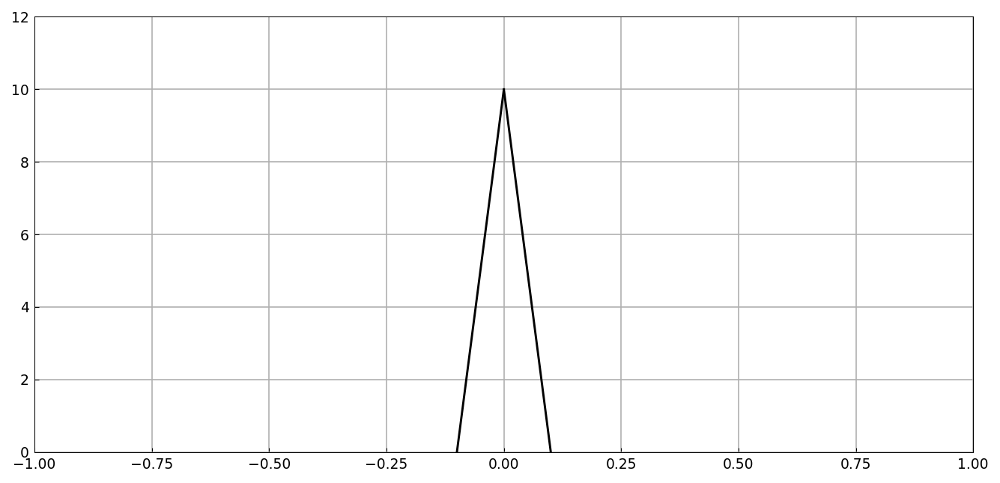
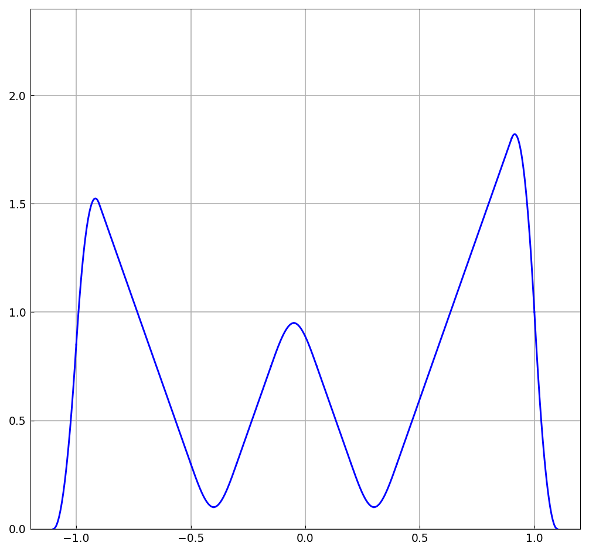
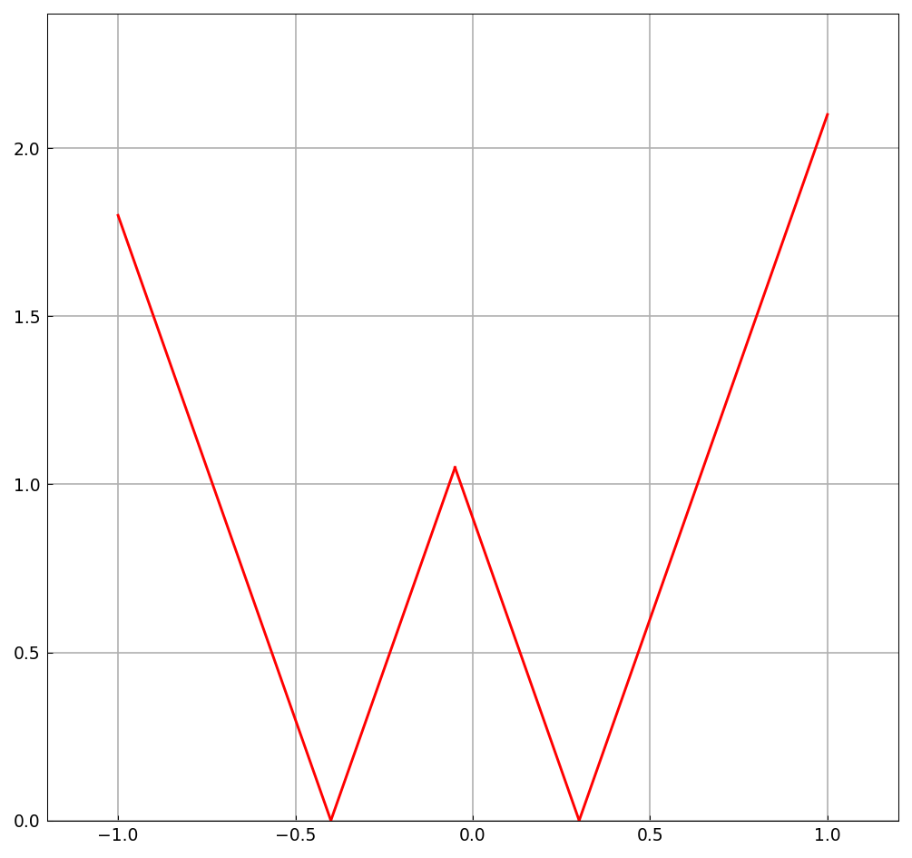
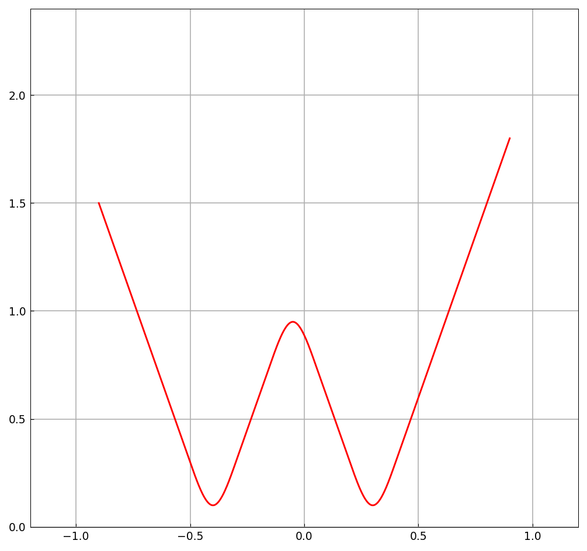

# Rounding corners by convolution

*Nick Trefethen, October 2011*

[Original MATLAB Chebfun example](https://www.chebfun.org/examples/geom/RoundingCorners.html)

(Chebfun example geom/RoundingCorners.m)

A piecewise-linear function with two corners:

Convolving with a narrow hat function of width $0.2$ (a mollifier)

rounds the corners into $C^1$ parabolic arcs:

The same trick applies to a planar curve, convolving each coordinate:

---

*Replicated with [chebfunjax](https://github.com/ma-gilles/chebfunjax); original
example copyright The University of Oxford and The Chebfun Developers.*
