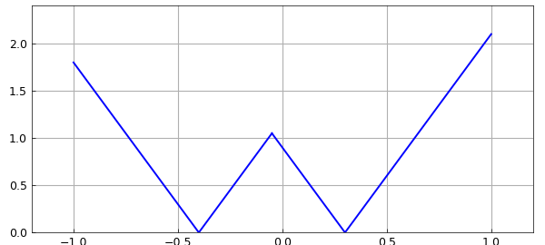
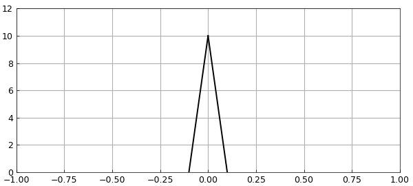
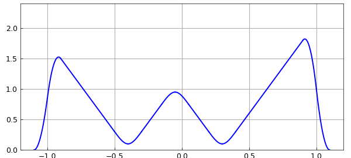
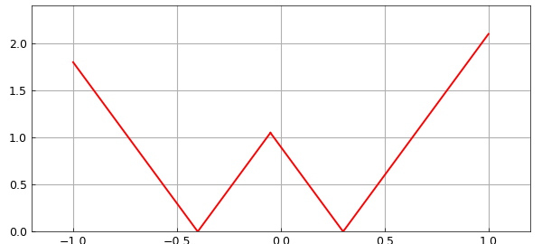
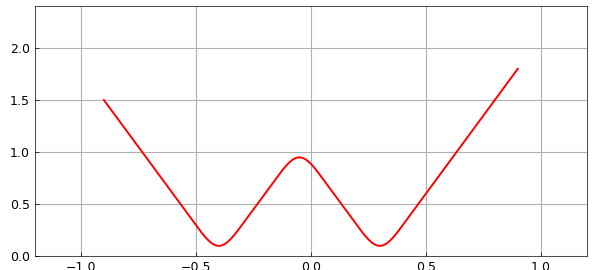

# Rounding corners by convolution

*Nick Trefethen, November 2012*

[Original MATLAB Chebfun example](https://www.chebfun.org/examples/geom/RoundingCorners.html)

Python translation: [`examples/geom/rounding_corners.py`](https://github.com/ma-gilles/chebfunjax/blob/main/examples/geom/rounding_corners.py)

Here is a function with the shape of a *W*:

```matlab
t = chebfun(@(t) t);
f = 3*min(abs(t+.4),abs(t-.3));
ax = [-1.2 1.2 0 2.4];
plot(f), axis(ax), axis square, grid on
```



And here is a narrow function with integral equal to $1$:

```matlab
h = 0.1;
s = chebfun(@(s) s,[-h h]);
g = (h-abs(s))/h^2;
plot(g,'k'), axis([-1 1 0 12]), grid on
```



If we convolve the two functions, we get a *W* with rounded corners. At the ends, the "rounding" has brought the values down to $0$:

```matlab
f2 = conv(f,g);
plot(f2), axis(ax), axis square, grid on
```



Let's try a similar but different computation in which the *W* is not a real function of a real variable, but a complex function of a real parameter. Here is that complex function:

```matlab
W = t + 1i*f(t);
plot(W,'r'), axis(ax), axis square, grid on
```



And here is its convolution with `g`:

```matlab
W2 = conv(W,g);
plot(W2,'r'), axis(ax), axis square, grid on
```



Do you understand why this picture looks different from the previous one?

---

*Translated with [chebfunjax](https://github.com/ma-gilles/chebfunjax); prose and MATLAB code from the original example, copyright The University of Oxford and The Chebfun Developers.  Printed outputs and figures are chebfunjax's.*
