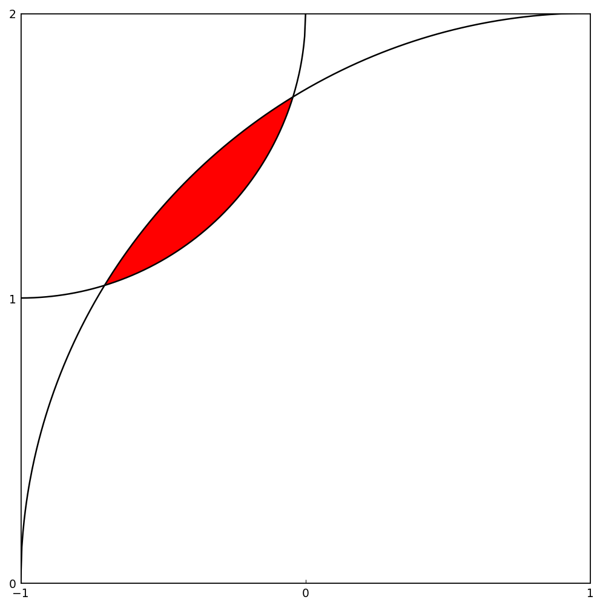

# The area between two circles

*Nick Trefethen, October 2011*

[Original MATLAB Chebfun example](https://www.chebfun.org/examples/geom/TwoCircles.html)

(Chebfun example geom/TwoCircles.m)

Two circular arcs cross inside the square $[-1,1]\times[0,2]$; where
do they intersect, and what is the lens-shaped area between them?
Splitting handles the square-root branch points, `roots` finds the
crossings, and a restricted integral gives the area:

```text
x1 =
  -0.705718913883838
x2 =
  -0.044281086116953
```



```text
area =
   0.107976470497055
exact =
   0.107976470497046
```

(13 digits against the closed form
$\arccos(5\sqrt2/8) + 4\arccos(11\sqrt2/16) - \sqrt7/2$.)

---

*Replicated with [chebfunjax](https://github.com/ma-gilles/chebfunjax); original
example copyright The University of Oxford and The Chebfun Developers.*
