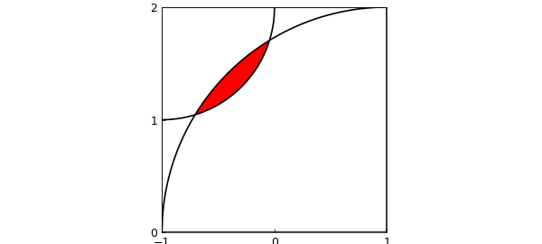

# Overlap of two circles

*Nick Trefethen, May 2016*

[Original MATLAB Chebfun example](https://www.chebfun.org/examples/geom/TwoCircles.html)

Python translation: [`examples/geom/two_circles.py`](https://github.com/ma-gilles/chebfunjax/blob/main/examples/geom/two_circles.py)

## 1. Two overlapping circles

Suppose you draw a quarter-circle of radius 1 about the point $(x,y) = (-1,1)$ and another quarter-circle of radius 2 about the point $(x,y) = (1,-1)$. We can draw the picture like this. Along the way, we find the two points of intersection of the two circles and use them to fill in the overlap region in red. (There must be a simpler way to do this in Chebfun.)

```matlab
bigcircle = chebfun(@(x) sqrt(4-(x-1).^2),'splitting','on');
littlecircle = chebfun(@(x) 2-sqrt(1-(x+1).^2),[-1,0],'splitting','on');
plot([-1 1 1 -1 -1],[0 0 2 2 0],'k'), hold on, axis equal
x = roots( bigcircle{-1,0} - littlecircle );
x1 = x(1), x2 = x(2)
t = chebfun(@(t) t,[x1 x2]); t_reverse = chebfun(@(t) x1+(x2-t),[x1 x2]);
fill(join(t,t_reverse),join(littlecircle(t),bigcircle(t_reverse)),'r')
plot(bigcircle,'k',littlecircle,'k'), axis([-1 1 0 2]), hold off
set(gca,'xtick',-1:1,'ytick',0:2)
```

```text
x1 =
  -0.705718913883074
x2 =
  -0.044281086116926
```



## 2. Area of the overlap region

This configuration comes from Alan Stevens' 2016 review [2] of *Professor Povey's Perplexing Problems* [1], a book published in 2015. The problem posed in [1] and [2] is, what is the area of the overlap region? Here is the numerical answer as computed by Chebfun:

```matlab
area = sum( bigcircle{x1,x2} - littlecircle{x1,x2} )
```

```text
area =
   0.107976470497048
```

This is a tricky problem! Here is the exact solution given by Prof. Povey:

```matlab
exact = acos(5*sqrt(2)/8) + 4*acos(11*sqrt(2)/16) - sqrt(7)/2
```

```text
exact =
   0.107976470497046
```

## 3. References

[1] T. Povey, *Professor Povey's Perplexing Problems: Pre-University Physics and Maths Puzzles with Solutions*, One World Publications, 2015, pp. 26-28.

[2] A. Stevens, review of above book, *Mathematics Today*, June 2016, p. 152.

---

*Translated with [chebfunjax](https://github.com/ma-gilles/chebfunjax); prose and MATLAB code from the original example, copyright The University of Oxford and The Chebfun Developers.  Printed outputs and figures are chebfunjax's.*
