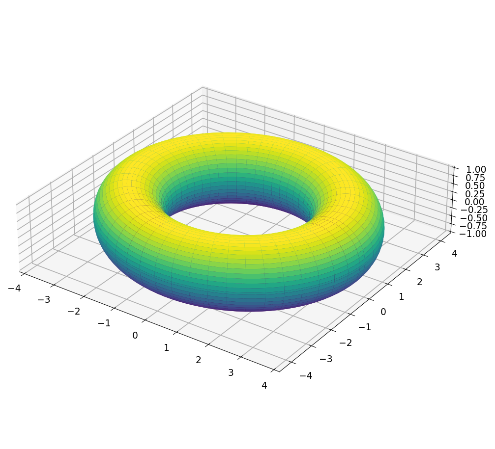
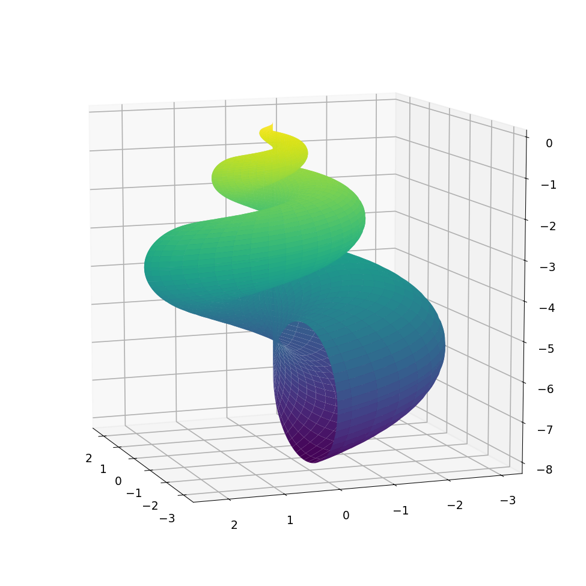

# The volume of a heart

*Rodrigo Platte, February 2013*

[Original MATLAB Chebfun example](https://www.chebfun.org/examples/geom/VolumeOfHeart.html)

(Chebfun example geom/VolumeOfHeart.m)

Green's theorem gives areas of planar curves — an ellipse
($2\pi$, digit-for-digit) and the classic heart curve:


```text
ans =
     5.654866776461629e+02
```

The divergence theorem turns volumes into flux integrals over
parametrized surfaces, with normals from chebfun2 partial
derivatives.  For a torus (exact $2\pi^2 \cdot 3$):



```text
Vol =
  59.217626406536176
Exact =
  59.217626406536148
Area =
     1.184352528130724e+02
Exact =
     1.184352528130723e+02
```

For a heart-shaped surface and its bounding box:


```text
Vol =
   2.199114857512856
VolBox =
   5.973333333333333
```

And a seashell, filling 21.4% of its box — digit-for-digit:



```text
Vol =
  55.256380423124710
ans =
   0.214222209177065
```

---

*Replicated with [chebfunjax](https://github.com/ma-gilles/chebfunjax); original
example copyright The University of Oxford and The Chebfun Developers.*
