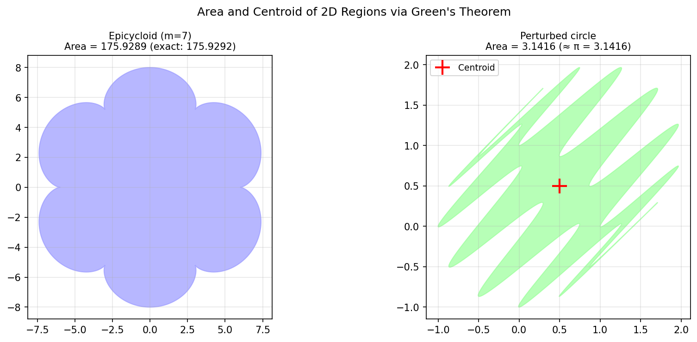

# Area and Centroid of a 2D Region

**Original:** [geom/Area](https://www.chebfun.org/examples/geom/Area.html)
**Author(s):** Stefan Guettel, October 2010

---

With Chebfun it is easy to compute with parametrized curves in the plane.
For example, the following lines define an epicycloid $(x(t), y(t))$ as a
pair of chebfuns in the variable $t$:

$$
x(t) = (a+b)\cos t - b\cos\!\left(\frac{a+b}{b}\,t\right), \quad
y(t) = (a+b)\sin t - b\sin\!\left(\frac{a+b}{b}\,t\right),
$$

with $b = 1$, $m = 7$, and $a = (m-1)b = 6$.

Such curves are called **epicycloids**, named by the Danish astronomer
Ole Romer in 1674. Epicycloids can be produced by tracing a point on a
circle which rolls out on a larger circle. Romer discovered that
cog-wheels with epicycloidal teeth turn with minimum friction.

## Area via Green's theorem

Although the epicycloid curve is not smooth, the functions $x(t)$ and
$y(t)$ that parameterize it are smooth, so Chebfun has no difficulty
representing them by global polynomials.

The area enclosed by a closed parametric curve $(x(t), y(t))$ can be
computed via Green's theorem:

$$
A = \oint x\,dy = \int_0^{2\pi} x(t)\,y'(t)\,dt.
$$

For an epicycloid with integer $m$, the exact area is

$$
A_{\text{exact}} = \pi b^2 (m^2 + m).
$$

## A more complicated curve

A more complicated curve can be defined as a single complex-valued
chebfun:

$$
z(t) = e^{it} + (1+i)\sin^2(6t).
$$

Because this curve is a perturbed unit circle, with every perturbation
occurring twice with opposite signs, the enclosed area equals $\pi$.

## Centroid

The centroid (or center of mass) of the enclosed region can be computed as

$$
c = \frac{1}{2iA} \int_0^{2\pi} z'(t)\,z(t)\,\overline{z(t)}\,dt.
$$

If you cut a piece of paper in this shape, it should remain balanced when
placed on a vertical needle centered at the centroid.

## Code

```python
from examples.geom.area_centroid import run
run()
```

## Output


