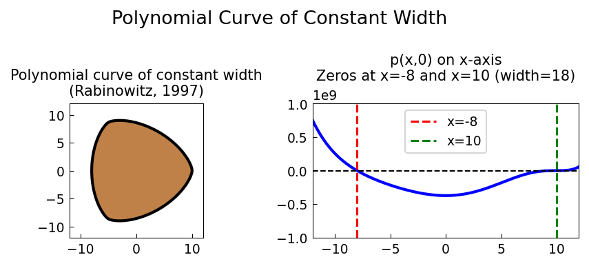

# Constant Width Curves

**Original:** [geom/ConstantWidth](https://www.chebfun.org/examples/geom/ConstantWidth.html)
**Author(s):** Hrothgar, March 2014

---

Zero set of the Rabinowitz polynomial: a curve with constant width in all directions.

## Code

```python
from examples.geom.constant_width import run
run()
```

## Output


