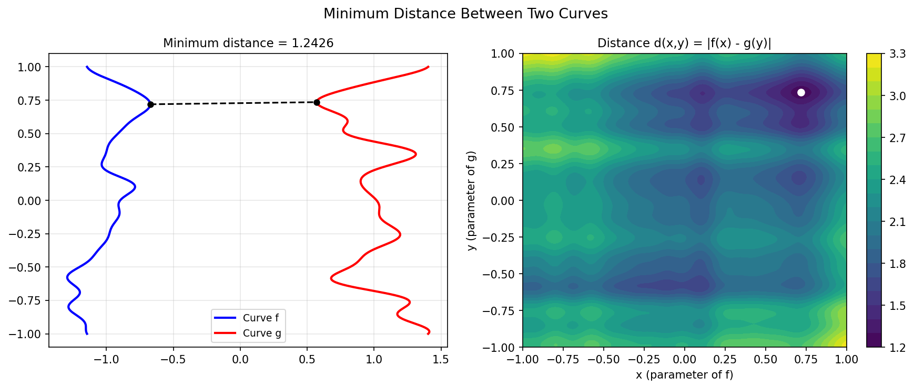

# Distance between Two Curves

**Original:** [geom/Curves](https://www.chebfun.org/examples/geom/Curves.html)
**Author(s):** Nick Trefethen, November 2022

---

Suppose we have two random parametric curves in the plane and we want to
know the closest distance between them. This is a great simplification
of problems that arise in computational geometry.

## Setting up the curves

We define two curves $f(t)$ and $g(t)$ as complex-valued chebfuns on
$[-1, 1]$, each consisting of a vertical line segment perturbed by a
smooth random function:

$$
f(t) = it + 0.2\,r_1(t) - 1, \qquad g(t) = it + 0.2\,r_2(t) + 1,
$$

where $r_1$ and $r_2$ are random smooth functions with characteristic
wavelength 0.5.

## Finding the minimum distance

One approach is to construct a chebfun2 $d(s,t)$ representing the distance
between $f(s)$ and $g(t)$:

$$
d(s,t) = |f(s) - g(t)|.
$$

This two-dimensional function can be visualized as a contour plot in the
$(s,t)$ parameter plane.

The global minimum of $d$ gives the closest distance and the parameter
values at which it occurs. These can be used to identify the closest
points on each curve and draw a line segment between them.

## Code

```python
from examples.geom.curves_distance import run
run()
```

## Output


