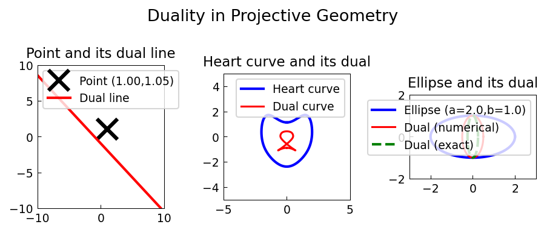

# Dual Curves

**Original:** [geom/DualCurves](https://www.chebfun.org/examples/geom/DualCurves.html)
**Author(s):** Alex Townsend, August 2011

---

Point-line duality in projective geometry; dual of a heart curve and an ellipse.

## Code

```python
from examples.geom.dual_curves import run
run()
```

## Output


