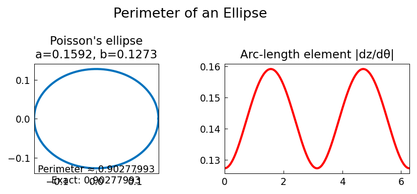

# Perimeter of an Ellipse

**Original:** [geom/Ellipse](https://www.chebfun.org/examples/geom/Ellipse.html)
**Author(s):** Nick Hale and Nick Trefethen, December 2010

---

The perimeter of an ellipse with semiaxis lengths $a$ and $b$ is given by
the complete elliptic integral

$$
L = \int_0^{2\pi} \sqrt{a^2\sin^2\theta + b^2\cos^2\theta}\;d\theta,
$$

which has no closed-form expression in terms of elementary functions.
This makes it a classic benchmark for numerical quadrature.

## Poisson's ellipse

The ellipse used here is the one studied by Poisson in his paper of 1827
[1], with semiaxis lengths $a = 0.5/\pi$ and $b = 0.4/\pi$. Poisson
reported the perimeter as $0.90277992$ (with a misprint in the second
decimal place -- he actually wrote "0,9927799272").

The known benchmark value for the perimeter is

$$
L = 0.90277992777219\ldots
$$

## Computing the perimeter with Chebfun

With Chebfun, the perimeter is simply the 1-norm of the arc-length
element:

$$
L = \int_0^{2\pi} \sqrt{x'(\theta)^2 + y'(\theta)^2}\;d\theta
  = \bigl\|\sqrt{x'^2 + y'^2}\bigr\|_1.
$$

This can be computed to full machine precision in a fraction of a second.

## Reference

1. S.-D. Poisson, Sur le calcul numerique des integrales definies,
   _Memoires de L'Academie Royale des Sciences de L'Institut de France_
   4 (1827), pp. 571--602 (written in 1823).

## Code

```python
from examples.geom.ellipse import run
run()
```

## Output


