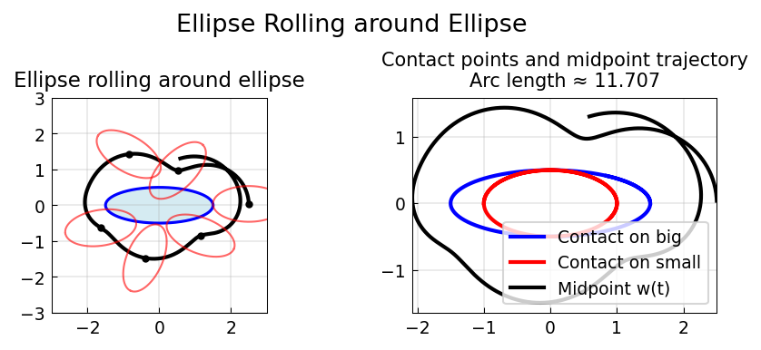

# An Ellipse Rolling around Another Ellipse

**Original:** [geom/Ellipses](https://www.chebfun.org/examples/geom/Ellipses.html)
**Author(s):** Nick Trefethen, October 2011

---

Here is a problem from Oxford's Numerical Analysis Group Problem Solving
Squad in October 2011. A $2\times1$ ellipse is lined up touching a
$3\times1$ ellipse tip-to-tip, and then the little ellipse rolls around
the big one with boundaries touching and not slipping. How long is the
trajectory of the center of the little ellipse from the starting point
to when it completes a full 360-degree revolution?

## Setting up the ODE

For convenience, since the geometry is 2D, we use complex variables
$z_1(t)$ and $z_2(t)$ to track the contact points on the two ellipse
boundaries as a function of time $t$, assuming motion at speed 1. Let
$\theta_1(t)$ be the argument of $z_1(t)$ scaled down to the unit circle:

$$
z_1 = \tfrac{1}{2}L_1\cos\theta_1 + \tfrac{1}{2}i\sin\theta_1.
$$

We have

$$
\frac{dz_1}{d\theta_1} = -\tfrac{1}{2}L_1\sin\theta_1
  + \tfrac{1}{2}i\cos\theta_1, \qquad
\frac{dt}{d\theta_1} = \tfrac{1}{2}\sqrt{L_1^2\sin^2\theta_1
  + \cos^2\theta_1}.
$$

Dividing gives an ODE for $dz_1/dt$. Similarly for the small ellipse,
with a sign change since $\theta_2$ decreases with $t$.

## The midpoint trajectory

The midpoint $w(t)$ of the small ellipse traces a closed curve, computed
by the formula

$$
w(t) = z_1(t) - z_2(t)\,\frac{z_1'(t)}{z_2'(t)}.
$$

The trajectory length is the 1-norm of $w'(t)$ integrated up to the
time at which $\mathrm{Im}(w(t)) = 0$ (when the small ellipse completes
a full revolution).




## Code

```python
from examples.geom.ellipses_rolling import run
run()
```
