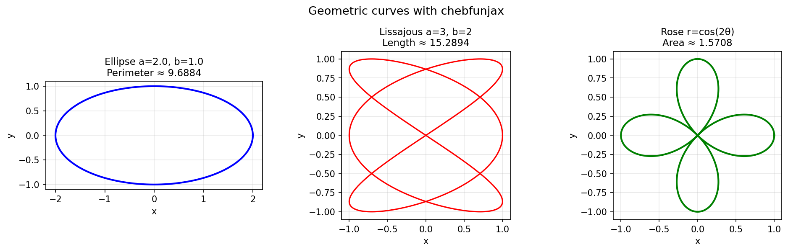
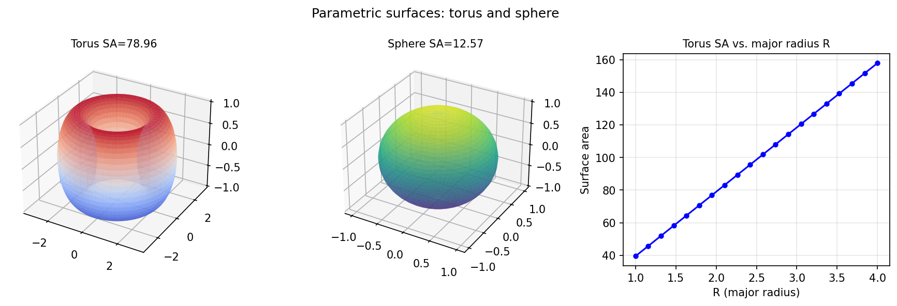

# Geometry Examples

Chebfunjax excels at computing with parametric curves and surfaces: arclengths,
areas, perimeters, and more — all computed to near machine precision.

---

## Curves and arclengths

**Source:** `geom/Ellipse.m` — Hale & Trefethen, December 2010;
`geom/Lissajous.m` — Trefethen, October 2010;
`geom/RoseCurves.m` — Hrothgar, June 2014

```python
import jax.numpy as jnp
import chebfunjax as cj

# Ellipse perimeter: integrate sqrt((a sin t)^2 + (b cos t)^2)
a, b = 2.0, 1.0
domain = [0.0, 2.0 * float(jnp.pi)]
ds = cj.chebfun(
    lambda t: jnp.sqrt((a * jnp.sin(t))**2 + (b * jnp.cos(t))**2),
    domain=domain
)
perimeter = ds.sum()
print(f"Ellipse perimeter: {float(perimeter):.10f}")

# Rose curve area: (1/2) ∫ r^2 dθ
r2 = cj.chebfun(lambda t: 0.5 * jnp.cos(2*t)**2, domain=domain)
area = r2.sum()
print(f"Rose area: {float(area):.8f}")   # = π/2
```



---

## Parametric surfaces

**Source:** `geom/ParametricSurfaces.m` — Rodrigo Platte, March 2013;
`geom/VolumeOfHeart.m` — Rodrigo Platte, April 2013

```python
import numpy as np

# Torus surface area = 4π²Rr
R, r = 2.0, 1.0
integrand = cj.chebfun(lambda v: r * (R + r * jnp.cos(v)), domain=domain)
area_torus = 2 * np.pi * float(integrand.sum())
print(f"Torus SA: {area_torus:.8f}  (exact: {4*np.pi**2*R*r:.8f})")
```



---

## Other geometry examples

| MATLAB example | Description |
|---|---|
| `geom/Area.m` | Area and centroid via Green's theorem |
| `geom/ConstantWidth.m` | Curves of constant width |
| `geom/DualCurves.m` | Duality in projective geometry |
| `geom/Ellipses.m` | Ellipse rolling around another ellipse |
| `geom/Procrustes.m` | Procrustes shape analysis |
| `geom/RoundingCorners.m` | Corner rounding via convolution |
| `geom/Sinai.m` | Sinai billiards (bouncing photon) |
| `geom/TwoCircles.m` | Area of overlap of two circles |
