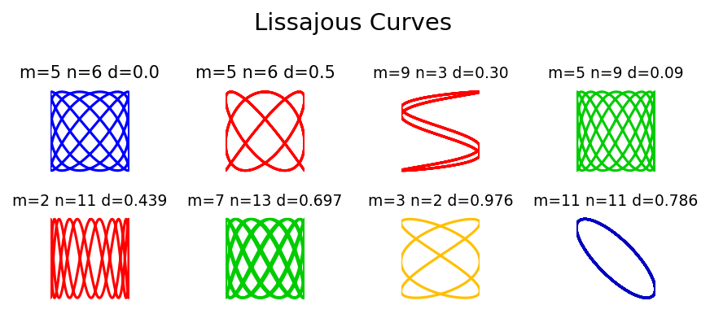

# Lissajous Curves

**Original:** [geom/Lissajous](https://www.chebfun.org/examples/geom/Lissajous.html)
**Author(s):** Nick Trefethen, October 2010

---

Lissajous figures or Lissajous curves are the curves in the $x$-$y$ plane
obtained by taking $x$ and $y$ to vary sinusoidally with respect to a
parameter $t$, typically with different frequencies. They are named after
the 19th century French mathematician Jules Antoine Lissajous.

## Definition

Assuming unit amplitude and positive integer frequencies, a Lissajous
figure is a closed curve ($2\pi$-periodic in $t$) defined by parameters
$m$, $n$, and $d$:

$$
x(t) = \sin(mt), \qquad y(t) = \sin(nt + d\pi).
$$

For example, the cases $m = 5$, $n = 6$ with $d = 0$ and $d = 1/2$
produce visually distinct patterns. As usual with 2D computations, it
is convenient to use complex arithmetic:

$$
z(t) = x(t) + iy(t) = \sin(mt) + i\cos(nt + d\pi).
$$

## Gallery

The example generates a $6\times6$ grid of Lissajous curves for
random values of $m$, $n$, and $d$, revealing the rich variety of
patterns. Rational frequency ratios $m/n$ produce closed curves, while
irrational ratios would produce curves of infinite length that fill the
unit square.

The visual appearance depends strongly on the phase shift $d$: for
$d = 0$ the curve typically passes through the corners of the bounding
box, while $d = 1/2$ shifts the vertical oscillation by a quarter-period.




## Code

```python
from examples.geom.lissajous import run
run()
```
