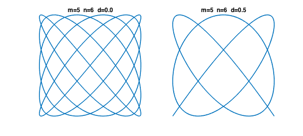
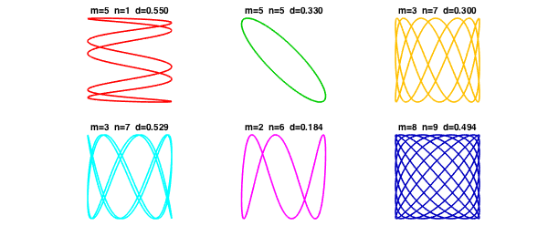
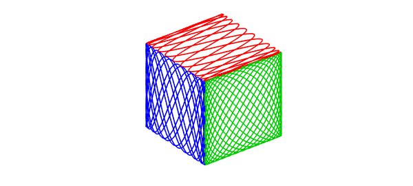

<!-- Generated by scripts/sync_chebfun_examples.py. -->
<!-- Source: https://www.chebfun.org/examples/geom/Lissajous.html -->

<h1>Lissajous curves</h1>
<h2>Nick Trefethen, October 2010 in <a href='../'>geom</a><a href='/examples/geom/Lissajous.m'>download</a>&middot;<a href='//github.com/chebfun/examples/blob/master/geom/Lissajous.m'>view on GitHub</a></h2>

Lissajous figures or Lissajous curves are the curves in the $x$-$y$ plane obtained by taking $x$ and $y$ to vary sinusoidally with respect to a parameter $t$, typically with different frequencies.  They are named after the 19th century French mathematician Jules Antoine Lissajous.

To keep things simple let's assume that the sine waves in both directions have amplitude $1$ and the frequencies are both positive integers, hence rationally related.  Then the Lissajous figure is a closed curve (i.e., $2\pi$-periodic with respect to $t$) that we can define by parameters $m$, $n$, and $d$.

$$ x(t) = \sin(mt), \qquad y(t) = \sin(nt+d\pi). $$

For example, here are the cases $m=5$, $n=6$ with $d=0$ and $d=1/2$:

<pre class="mcode-input">t = chebfun('t',[0 2*pi]);
m = 5; n = 6;
x = sin(m*t);
y = sin(n*t);
LW = 'Linewidth'; lw = 1.6; FS = 'fontsize';
subplot(1,2,1), plot(x,y,LW,lw)
axis([-1 1 -1 1]), axis square off
title(sprintf('m=%d  n=%d  d=%3.1f',m,n,0),FS,12)
y = sin(n*t+pi/2);
subplot(1,2,2), plot(x,y,LW,lw)
title(sprintf('m=%d  n=%d  d=%3.1f',m,n,0.5),FS,12)
axis([-1 1 -1 1]), axis square off</pre>

As usual with 2D computations, it's convenient to use complex arithmetic, defining

$$ z(t) = x(t) + iy(t). $$

Here's an anonymous function that returns a Chebfun corresponding to parameters $m$, $n$, $d$:

<pre class="mcode-input">lissajous = @(m,n,d) sin(m*t) + 1i*cos(n*t+pi*d);</pre>

Here are six Lissajous curves drawn at random:

<pre class="mcode-input">clf
rng(2);
colors = [1 0 0; 0 .8 0; 1 .75 0; 0 1 1; 1 0 1; 0 0 .75];
for np = 1:6
  subplot(2,3,np)
  m = ceil(10*rand);
  n = ceil(10*rand);
  d = rand;
  plot(lissajous(m,n,d),LW,lw,'color',colors(np,:))
  axis([-1 1 -1 1]), axis square off
  title(sprintf('m=%d  n=%d  d=%5.3f',m,n,d),FS,10)
end</pre>

Just for fun, let's draw a cube in which each face is a different Lissajous figure:

<pre class="mcode-input">clf
f = lissajous(23,5,.5);
plot3(real(f),imag(f),1+0*t,'r'), hold on
f = lissajous(7,16,2/3);
plot3(-1+0*t,real(f),imag(f),'b')
f = lissajous(13,17,0);
plot3(real(f),-1+0*t,imag(f),'color',[0 .8 0])
axis equal off</pre>

        

    

