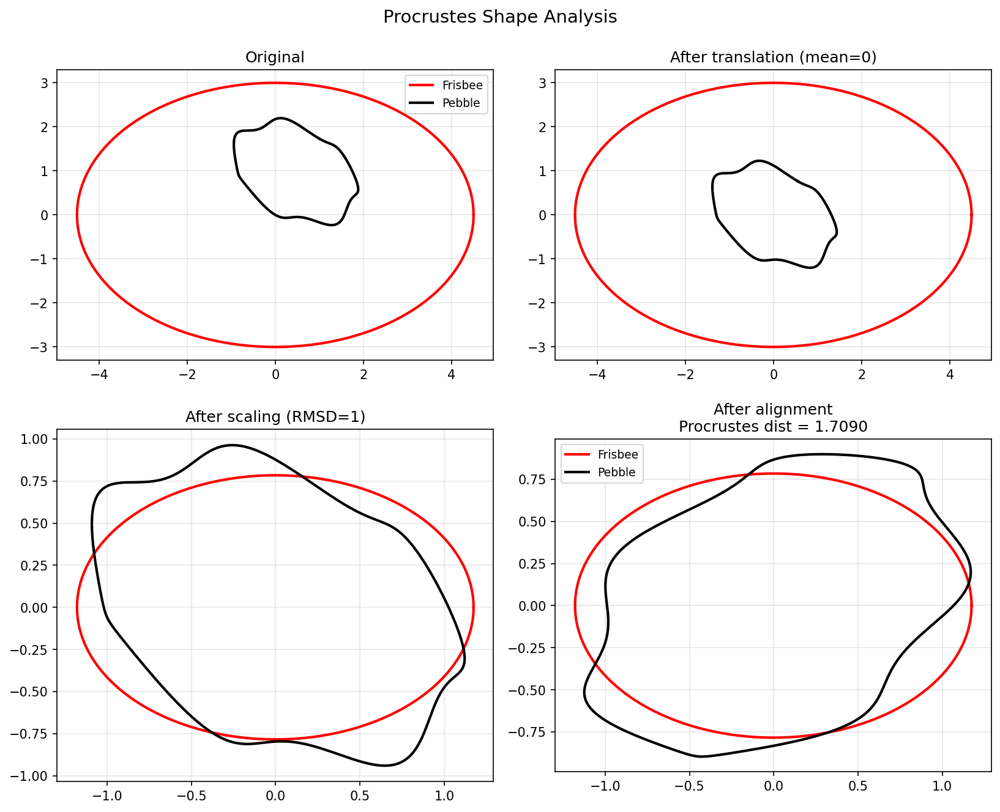

# Procrustes Shape Analysis

**Original:** [geom/Procrustes](https://www.chebfun.org/examples/geom/Procrustes.html)
**Author(s):** Alex Townsend, August 2011

---

Align two shapes by minimizing sum of squared distances via rotation, scaling, translation.

## Code

```python
from examples.geom.procrustes import run
run()
```

## Output


