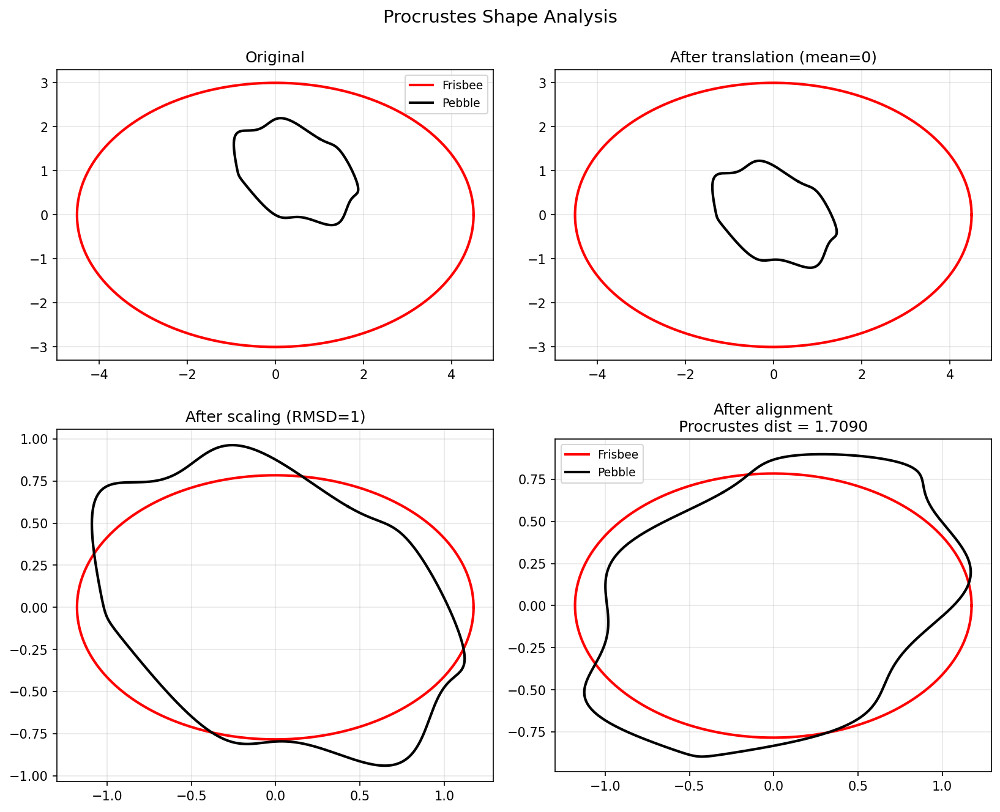
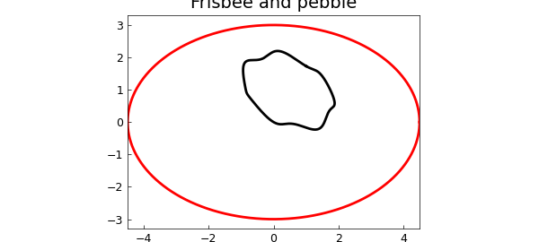
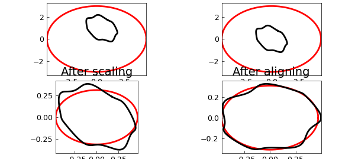
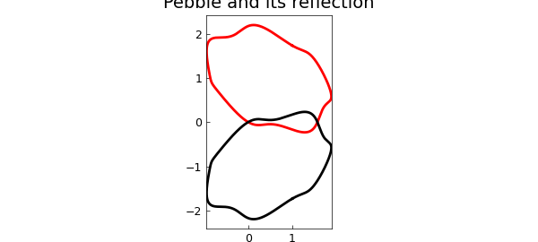
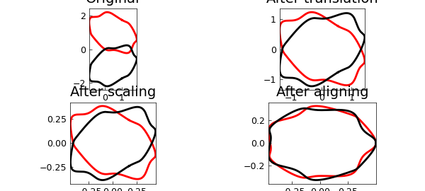

# Procrustes Shape Analysis

**Original:** [geom/Procrustes](https://www.chebfun.org/examples/geom/Procrustes.html)
**Author(s):** Alex Townsend, August 2011

---

Procrustes analysis is a method for analysing sets of shapes [1]. In this
example we pick up a pebble from the beach and ask how closely its shape
matches the outline of a frisbee.

## Shape equivalence

Two shapes are considered equivalent if one can be obtained from the other
by translating, scaling, and rotating. Before comparison we therefore:

1. **Translate** the shapes so they have mean zero.
2. **Scale** so the shapes have Root Mean Squared Distance (RMSD) to the
   origin of 1.
3. **Rotate** to align the major axis.

The frisbee is modelled as a $3:2$ ellipse and the pebble as a more
complicated parametric curve involving higher harmonics of $\sin(3t)$.

## Continuous Procrustes distance

In the discrete version of Procrustes analysis, statisticians choose
reference points on the two shapes and compute the vector 2-norm of the
difference between corresponding points. In the continuous Chebfun
analogue, we compute

$$
d(f, g) = \|f - g\|_2 = \left(\int_0^{2\pi} |f(t) - g(t)|^2\,dt\right)^{1/2},
$$

where $f$ and $g$ are the complex-valued chebfuns parameterizing the
two curves after translation, scaling, and alignment.

## A caveat on parameterization

The continuous Procrustes distance depends on the parameterization of the
two curves. A different parameterization gives a different error, so this
continuous version is more of an "eyeball" check than a robust statistical
analysis.

## A shape and its reflection

An interesting question is: how close, in shape, is a pebble to its
reflection? Comparing the pebble with its mirror image shows that it
is actually closer in shape to a frisbee than to its own reflection!

## Reference

1. [Wikipedia: Procrustes](http://en.wikipedia.org/wiki/Procrustes)




## Code

```python
import numpy as np

t = np.linspace(0, 2 * np.pi, 400)
f = 3 * (1.5 * np.cos(t) + 1j * np.sin(t))                    # frisbee
g = np.exp(1j * np.pi / 3) * (1 + np.cos(t) + 1.5j * np.sin(t)
    + 0.125 * (1 + 1.5j) * np.sin(3 * t) ** 2)                # pebble
F = np.column_stack([np.real(f - f.mean()), np.imag(f - f.mean())])
G = np.column_stack([np.real(g - g.mean()), np.imag(g - g.mean())])
U, S, Vt = np.linalg.svd(F.T @ G)
print("optimal rotation:")
print(U @ Vt)
```

## Figures (chebfun.org parity)








