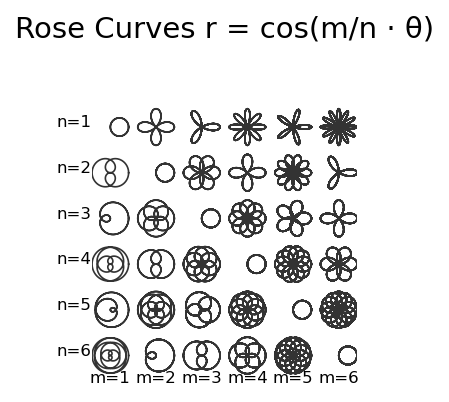

# Rose Curves

**Original:** [geom/RoseCurves](https://www.chebfun.org/examples/geom/RoseCurves.html)
**Author(s):** Hrothgar, June 2014

---

A **rose curve** is a sinusoid in polar coordinates:

$$
r = \sin(k\theta).
$$

Rational values of $k$ produce closed curves, while irrational values
produce curves of infinite length that fill the unit disc. If $k = 1$,
the result is a circle. These figures can be likened to Lissajous curves
[1].

## Parameterization

To plot the roses, we parameterize them in the complex plane using
Cartesian coordinates:

$$
x(t) = \cos(k\,t)\sin t, \qquad y(t) = \cos(k\,t)\cos t.
$$

For $k = m/n$ with integers $m$ and $n$, the curve closes after a
domain of length $2\pi\,\mathrm{lcm}(m, n)$.

## Grid of roses

The Wikipedia page about rose curves [2] contains a nice image of many
roses for different rational values of $k = m/n$. This example reproduces
that image with a $6\times6$ grid. The patterns along diagonals become
particularly clear: when $m/n$ is in lowest terms, the number of petals
depends on whether $m$ and $n$ are odd or even.

## Fourier-based representation

The `'trig'` flag enables Fourier-based chebfuns, which for smooth
periodic functions reduces the average number of terms necessary to
represent the function by a factor of about $\pi/2$ compared with
polynomial chebfuns.

## References

1. Chebfun Example [geom/Lissajous](Lissajous.html)

2. [Wikipedia: Rose curve](https://en.wikipedia.org/wiki/Rose_curve)




## Code

```python
from examples.geom.rose_curves import run
run()
```
