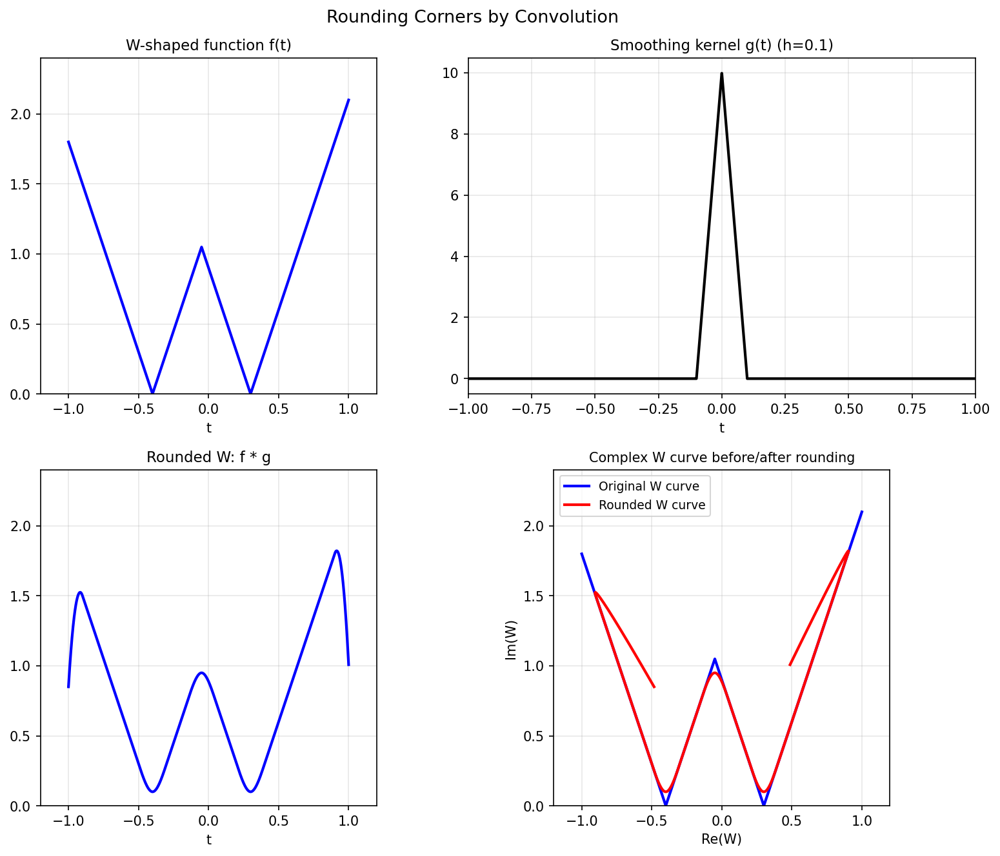

# Rounding Corners

**Original:** [geom/RoundingCorners](https://www.chebfun.org/examples/geom/RoundingCorners.html)
**Author(s):** Nick Trefethen, October 2010

---

W-shape convolved with a tent function: corners rounded by the width of the tent.

## Code

```python
from examples.geom.rounding_corners import run
run()
```

## Output


