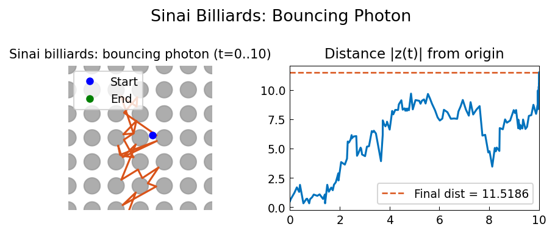

# Bouncing Photon -- Sinai Billiards

**Original:** [geom/Sinai](https://github.com/chebfun/examples/blob/master/geom/Sinai.m)
**Author(s):** Nick Trefethen, May 2011

---

## The SIAM 100-Dollar, 100-Digit Challenge

Problem 2 of the SIAM 100-Dollar, 100-Digit Challenge [1] reads:

> A photon moving at speed 1 in the $x$-$y$ plane starts at time $t=0$
> at $(x,y) = (1/2, 1/10)$ heading due east. Around every integer
> lattice point $(i,j)$ in the plane, a circular mirror of radius $1/3$
> has been erected. How far from $(0,0)$ is the photon at $t = 10$?

Mathematically, this problem is elementary. All that is involved is
straight lines, intersections with circles, and adjustments of angles at
reflection.

## Computing the trajectory

The trajectory is represented as a piecewise linear complex chebfun on
$[0, 10]$, where the complex variable $z = x + iy$ encodes the two
spatial dimensions. Each segment between bounces is a linear function of
$t$ (constant speed), and the segments are concatenated.

The key computational step is the function `nextpoint`: given a current
position $p_0$ and direction $d_0$, it finds the next intersection with
a mirror. It does this by repeatedly moving a distance 0.15 (less than
$1/6$, which is the minimum gap between any mirror and the unit squares
surrounding adjacent mirrors), checking for intersections with the
currently closest circle.

## Results

The distance from the origin at $t = 10$ is approximately $0.9953$. The
photon undergoes about 8 bounces in this time.

## Chaos and the Sinai billiard

This system is an instance of the chaotic dynamical system known as the
**Sinai billiard**. At every bounce off a circular mirror, the difference
between two nearby trajectories is amplified, leading to exponential
divergence -- the hallmark of chaos.

Two trajectories starting from initial points differing by $10^{-14}$
diverge at a rate of approximately $e^{2.3t}$, where the coefficient 2.3
is the Lyapunov exponent. Over 10 time units, about 10 digits of accuracy
are lost, so the solution to the original Challenge problem is only
accurate to about 5 digits. (The exact solution is
$0.99526291944\ldots$)

Over 20 time units, all accuracy is eliminated entirely. The blame lies
not with the numerical method but with floating-point arithmetic. To get
more digits, one needs higher-precision arithmetic; a solution to 10,002
digits is reported in Appendix B of [1].

## References

1. F. Bornemann, D. Laurie, S. Wagon, J. Waldvogel, _The SIAM
   100-Digit Challenge_, SIAM, 2004.

2. S. H. Strogatz, _Nonlinear Dynamics and Chaos_, Addison Wesley, 1994.




## Code

```python
from examples.geom.sinai_billiards import run
run()
```
