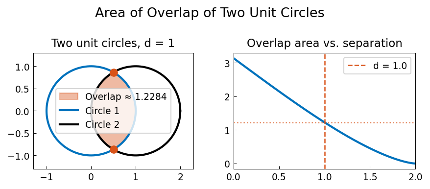

# Overlap of Two Circles

**Original:** [geom/TwoCircles](https://www.chebfun.org/examples/geom/TwoCircles.html)
**Author(s):** Nick Trefethen, May 2016

---

## Two overlapping circles

Suppose you draw a quarter-circle of radius 1 about the point
$(x,y) = (-1,1)$ and another quarter-circle of radius 2 about the point
$(x,y) = (1,-1)$. The two arcs intersect at two points $x_1$ and $x_2$,
which can be found as the roots of the equation where the two circle
functions are equal.

This configuration comes from Alan Stevens' 2016 review [2] of _Professor
Povey's Perplexing Problems_ [1], a book published in 2015.

## Area of the overlap region

The problem posed in [1] and [2] is: what is the area of the overlap
region? The area is the integral of the difference between the upper and
lower arcs between the two intersection points:

$$
A = \int_{x_1}^{x_2} \bigl[f_{\text{big}}(x) - f_{\text{little}}(x)\bigr]\,dx.
$$

With Chebfun, this integral can be computed to machine precision.

## Exact solution

Professor Povey gives the exact answer:

$$
A = \arccos\!\left(\frac{5\sqrt{2}}{8}\right)
  + 4\arccos\!\left(\frac{11\sqrt{2}}{16}\right)
  - \frac{\sqrt{7}}{2}.
$$

This is a tricky problem -- the exact formula involves inverse
trigonometric functions and a square root, making it a good test of
numerical integration.

## References

1. T. Povey, _Professor Povey's Perplexing Problems: Pre-University
   Physics and Maths Puzzles with Solutions_, One World Publications,
   2015, pp. 26--28.

2. A. Stevens, review of above book, _Mathematics Today_, June 2016,
   p. 152.




## Code

```python
from examples.geom.two_circles import run
run()
```
