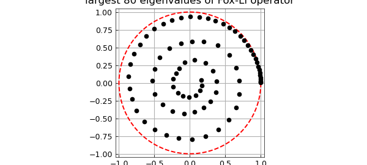

# Eigenvalues of the Fox-Li integral operator

*Toby Driscoll and Nick Trefethen, October 2010*

[Original MATLAB Chebfun example](https://www.chebfun.org/examples/integro/FoxLi.html)

Python translation: [`examples/integro/fox_li.py`](https://github.com/ma-gilles/chebfunjax/blob/main/examples/integro/fox_li.py)

In the field of optics, integral operators arise that have a complex symmetric (but not Hermitian) oscillatory kernel. An example is the following linear Fredholm operator $L$ associated with the names of Fox and Li (also Fresnel and H. J. Landau):

$$ v(x) = \sqrt{iF/\pi} \int_{-1}^1 K(x,s) u(s) ds. $$

$L$ maps a function $u$ defined on $[-1,1]$ to another function $v = Lu$ defined on $[-1,1]$. The number $F$ is a positive real parameter, the Fresnel number, and the kernel function $K(x,s)$ is

$$ K(x,s) = \exp(-iF(x-s)^2). $$

To create the operator in Chebfun, we define the kernel and use the `fred` function to build $L$:

```matlab
F = 64*pi;                                     % Fresnel number
K = @(x,s) exp(-1i*F*(x-s).^2 );               % kernel
L = sqrt(1i*F/pi) * chebop(@(u) fred(K,u));    % Fredholm integral operator
```

Computing the $80$ eigenvalues of largest complex magnitude requires just a call to `eigs` with the `'lm'` option:

```matlab
tic, lam = eigs(L,80,'lm'); toc
```

```text
Elapsed time is 5.058265 seconds.
```

A beautiful pattern emerges when we plot the results:

```matlab
x = chebfun('x');
clf, plot(exp(1i*pi*x),'--r')
hold on, plot(lam,'k.','markersize',14)
title('largest 80 eigenvalues of Fox-Li operator')
axis equal, axis(1.05*[-1 1 -1 1]), hold off
```



For a remarkable analysis of such patterns, see [1].

## References

1. A. Boettcher, H. Brunner, A. Iserles and S. P. Norsett, On the singular values and eigenvalues of the Fox-Li and related operators, *New York Journal of Mathematics*, 16 (2010), 539-561.
2. T. A. Driscoll, , *Journal of Computational Physics*, 229 (2010), 5980-5998. A. G. Fox and T. Li, Resonant modes in a maser interferometer, *Bell System Technical Journal*, 40 (1961), 453-488. L. N. Trefethen and M. Embree, *Spectra and Pseudospectra: The Behavior of Nonnormal Matrices and Operators*, Princeton University Press, 2005 (Chapter 60). © Copyright 2025 the University of Oxford and the Chebfun Developers.

---

*Translated with [chebfunjax](https://github.com/ma-gilles/chebfunjax); prose and MATLAB code from the original example, copyright The University of Oxford and The Chebfun Developers.  Printed outputs and figures are chebfunjax's.*
