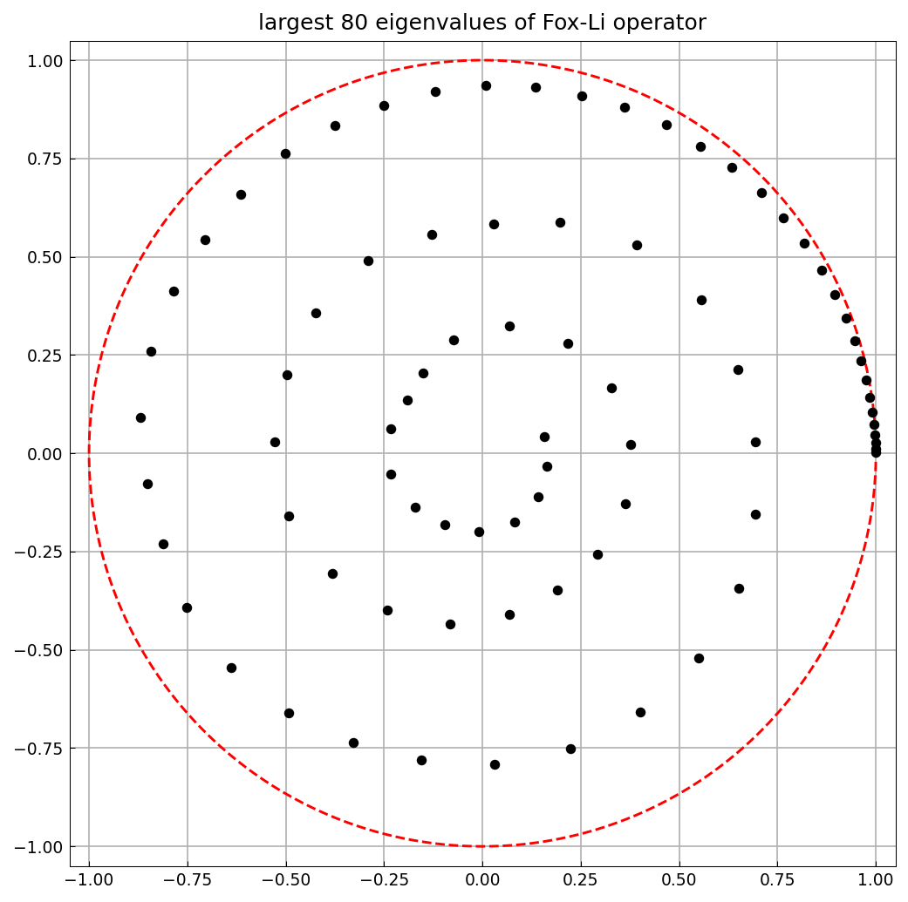

# Eigenvalues of the Fox-Li integral operator

*Toby Driscoll and Nick Trefethen, October 2010*

[Original MATLAB Chebfun example](https://www.chebfun.org/examples/integro/FoxLi.html)

(Chebfun example integro/FoxLi.m)

In the field of optics, integral operators arise that have a complex
symmetric (but not Hermitian) oscillatory kernel. An example is the
following linear Fredholm operator $L$ associated with the names of Fox
and Li (also Fresnel and H. J. Landau):

$$ (Lu)(x) = \sqrt{\frac{iF}{\pi}} \int_{-1}^{1}
   e^{-iF(x-s)^2} u(s)\, ds. $$

$L$ maps a function $u$ defined on $[-1,1]$ to another function $Lu$
defined on $[-1,1]$. The number $F$ is a positive real parameter, the
Fresnel number, and the eigenvalues of $L$ describe the modes of a laser
cavity. With $F = 64\pi$, the largest 80 eigenvalues (in magnitude) are
computed by collocation of the kernel with quadrature weights:

```python
F = 64 * np.pi
K = lambda x, s: jnp.exp(-1j * F * (x - s)**2)
lam = fred_eigs(K, k=80, which="LM", scale=np.sqrt(1j * F / np.pi))
```

```text
Elapsed time is 8.298908 seconds.
```

(The published page reports 12.9 seconds on 2010-era hardware; the
timing is machine-dependent.)

The eigenvalues spiral in toward the origin from near the unit circle:



---

*Replica script: [`examples/integro/fox_li_replica.py`](https://github.com/ma-gilles/chebfunjax/blob/main/examples/integro/fox_li_replica.py).
Original example copyright by The University of Oxford and The Chebfun
Developers.*
