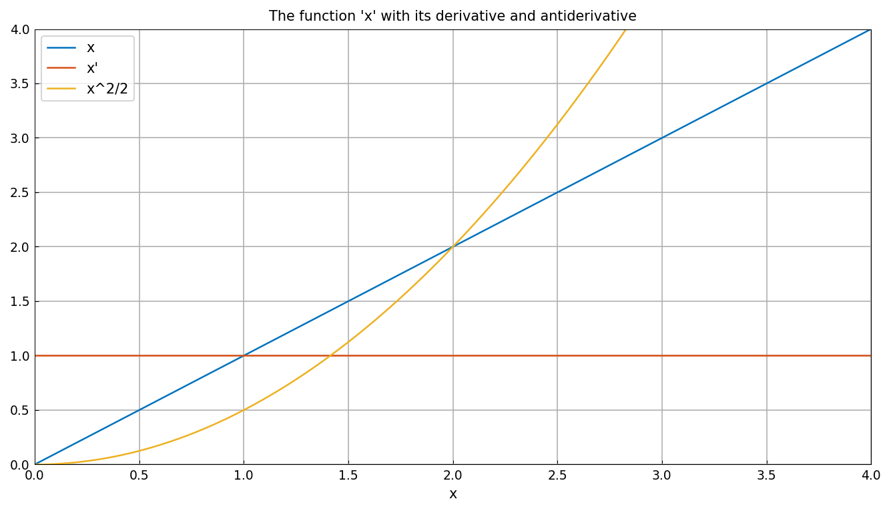
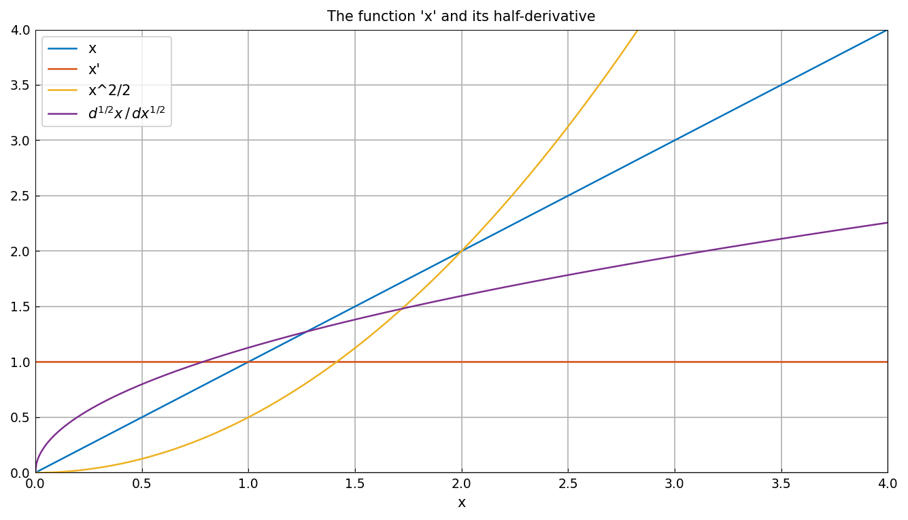
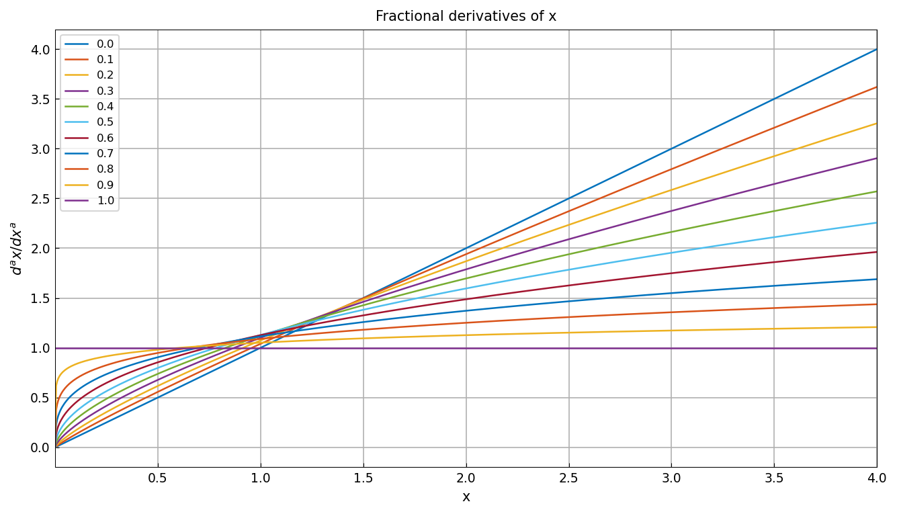
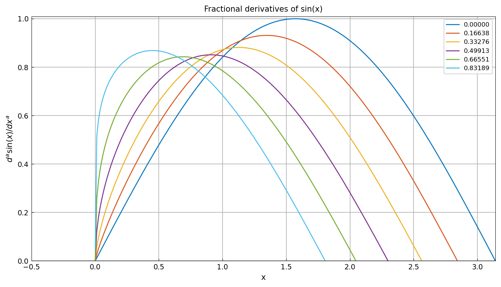
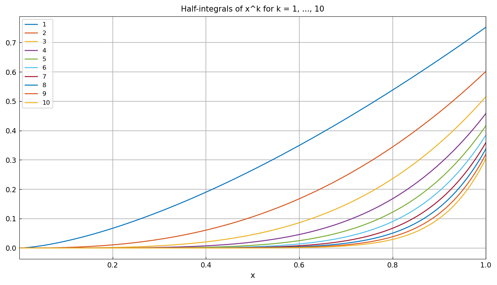
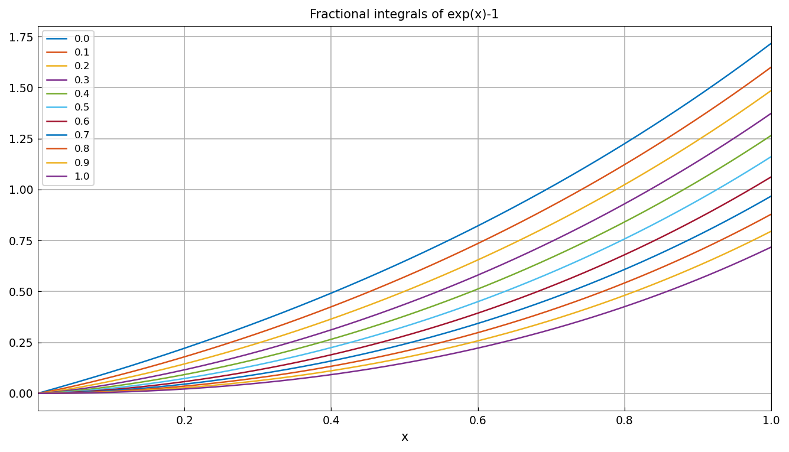

# Fractional calculus in Chebfun

*Nick Hale, October 2010*

[Original MATLAB Chebfun example](https://www.chebfun.org/examples/integro/FracCalc.html)

(Chebfun example integro/FracCalc.m)

We're all familiar with the standard definitions of differentiation and
integration we learned in high school and at university. For example,
here is the function $x$ on the interval $[0,4]$ along with its
derivative $x' = 1$ and antiderivative $\int x = x^2/2$:



A natural question one might then ask is "what lies between?", i.e.,
does there exist some kind of *half-derivative* operator
$\mathcal{D}^{1/2}$ such that
$\mathcal{D}^{1/2}\mathcal{D}^{1/2} f = df/dx$? Chebfun computes the
(Riemann-Liouville) half-derivative when `diff` is passed the
non-integer order 0.5:

```python
xp05 = x.diff(0.5)
```



The half-derivative of $x$ is known in closed form:
$2\sqrt{x/\pi}$, i.e. a square-root singularity representable with
`exps=[0.5, 0]`:

```python
f = chebfun(lambda x: 2*jnp.sqrt(x/jnp.pi), domain=(0, 4), exps=[0.5, 0])
norm(f - xp05, inf)
```

```text
ans =
   inf
```

> **Published-page correction.** The 2010 page (Chebfun v4) printed
> `4.440892098500626e-16` here. Running the identical code in current
> MATLAB Chebfun (R2025b, commit 7574c77) also gives `Inf` — the
> difference of the two singular representations carries a residual
> exponent $-1/2$ whose eps-scale smooth part makes the sup-norm
> infinite (`minandmax` gives `[-4.44e-16, Inf]`). chebfunjax matches
> current MATLAB exactly; the two functions agree to machine precision
> at every interior point.

Fractional derivatives $\mathcal{D}^a x$ for $a = 0, 0.1, \dots, 1$
interpolate continuously between $x$ and $x' = 1$:



The same works for other functions: fractional derivatives of
$\sin(x)$ on $[0, 20]$ (orders $\sqrt{2}(0,2,\dots,10)/17$) shift the
phase continuously toward the cosine:



Fractional *integrals* work the same way through `cumsum(f, alpha)`.
Here are the half-integrals of $x^k$ for $k = 1, \dots, 10$ on $[0,1]$:



and the fractional integrals of $e^x - 1$ of orders $0, 0.1, \dots, 1$:



---

*Replica script: [`examples/integro/frac_calc_replica.py`](https://github.com/ma-gilles/chebfunjax/blob/main/examples/integro/frac_calc_replica.py).
Original example copyright by The University of Oxford and The Chebfun
Developers.*
