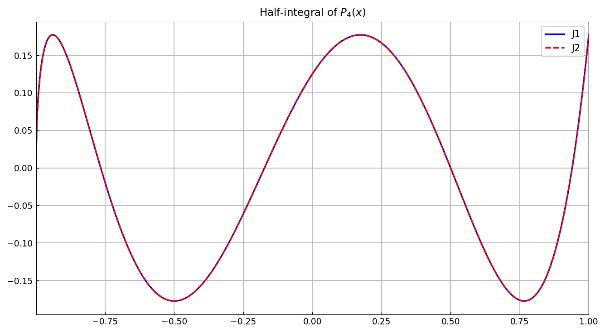
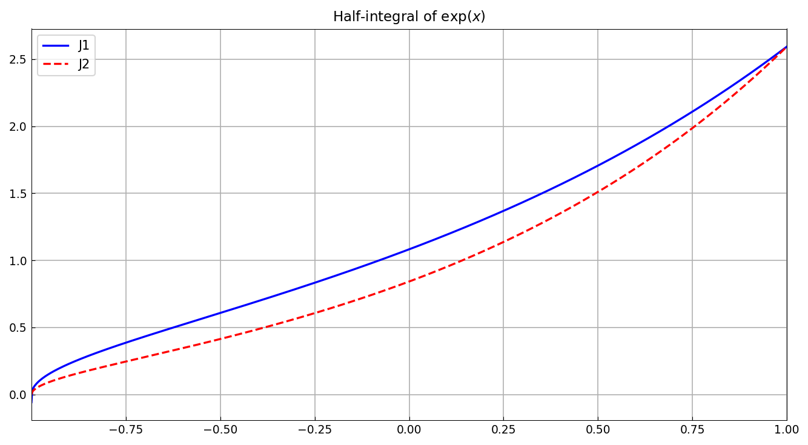
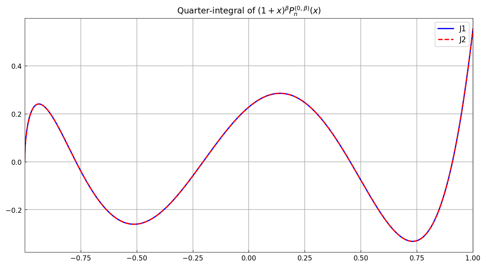
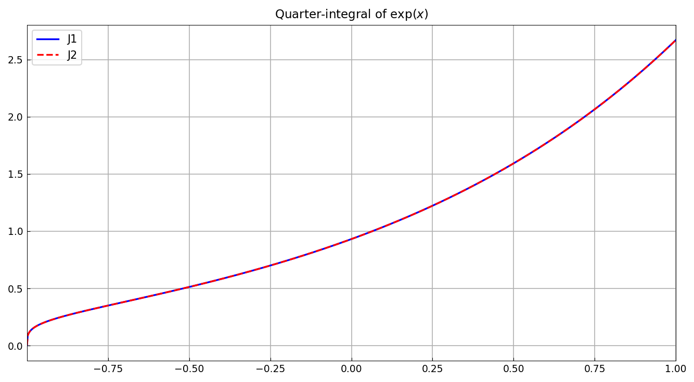
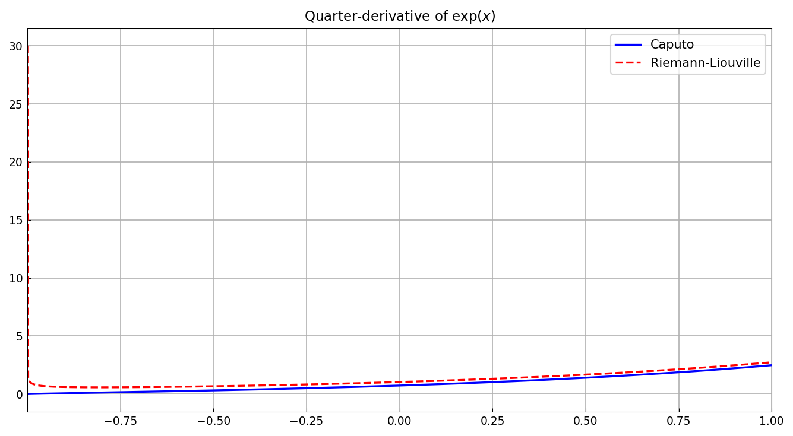
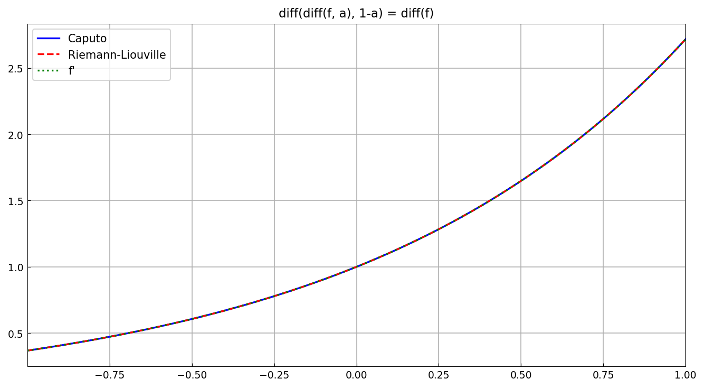

# Fractional calculus: closed-form formulas

*Nick Hale, June 2014*

[Original MATLAB Chebfun example](https://www.chebfun.org/examples/integro/FracCalc2.html)

(Chebfun example integro/FracCalc2.m)

Closed-form identities for Riemann-Liouville fractional integrals
$J^\mu$ verified against Chebfun's `cumsum(f, mu)`.

**Half-integral of $P_4(x)$.** For a Legendre polynomial the
half-integral has the closed form

$$ J^{1/2} P_n(x) = \frac{T_n(x) + T_{n+1}(x)}
   {\Gamma(1/2)\,(n+\tfrac12)\,\sqrt{1+x}} $$

in terms of Chebyshev polynomials:

**Half-integral of $e^x$.** Expanding in Legendre coefficients and
applying the same identity termwise:

**Quarter-integral of $(1+x)^\beta P_n^{(0,\beta)}(x)$.** For Jacobi
polynomials with weight $(1+x)^\beta$,

$$ J^{\mu}\left[(1+x)^\beta P_n^{(0,\beta)}\right] =
   \frac{B(\beta+n+1, \mu)}{\Gamma(\mu)} (1+x)^{\beta+\mu}
   P_n^{(-\mu,\,\beta+\mu)}(x) $$

with $B$ the Beta function ($n=4$, $\beta = 0.3$, $\mu = 1/4$):

**Quarter-integral of $e^x$** via Jacobi coefficients and the
`jac2cheb` transform:

**Fractional derivatives.** The Caputo
($\mathcal{D}^\mu = J^{n-\mu} D^n$) and Riemann-Liouville
($\mathcal{D}^\mu = D^n J^{n-\mu}$) quarter-derivatives of $e^x$
agree for this smooth function:

and applying the complementary $1-\mu$ derivative recovers
$f' = e^x$ in both conventions:

---

*Replica script: [`examples/integro/frac_calc2_replica.py`](https://github.com/ma-gilles/chebfunjax/blob/main/examples/integro/frac_calc2_replica.py).
Original example copyright by The University of Oxford and The Chebfun
Developers.*
