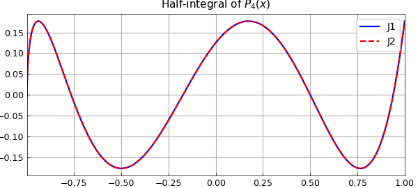
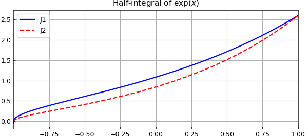
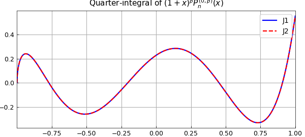
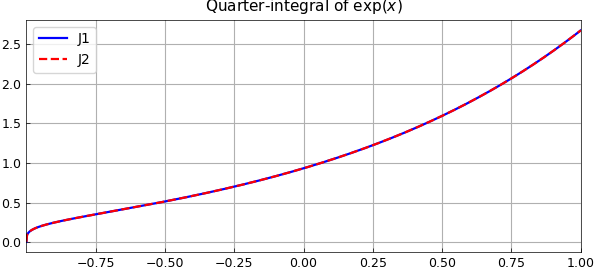
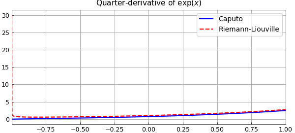
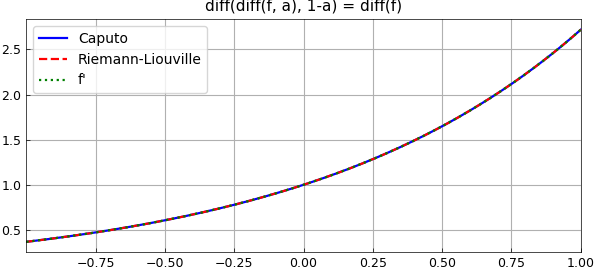

# Fractional calculus in Chebfun: algorithms

*Nick Hale, February 2015*

[Original MATLAB Chebfun example](https://www.chebfun.org/examples/integro/FracCalc2.html)

Python translation: [`examples/integro/frac_calc2.py`](https://github.com/ma-gilles/chebfunjax/blob/main/examples/integro/frac_calc2.py)

In [1] we showed some examples of fractional calculus computing in Chebfun. Here we give some details of the implementation. The key is that fractional integrals of Legendre and Jacobi polynomials (and 'polyfractonomials') are known explicitly.

```matlab
LW = 'LineWidth'; lw = 1.2; FS = 'FontSize'; fs = 10;
```

These are some useful shorthands that we'll use later:

```matlab
x = chebfun('x');
B = @(z, w) beta(z, w);                         % Beta function
P = @(n) legpoly(n);                            % Legendre polynomial
T = @(n) chebpoly(n);                           % Chebyshev polynomial
J = @(n, alpha, beta) jacpoly(n, alpha, beta);  % Jacobi polynomial
```

## Half-integral

We begin, as in [1], with the case of the half-integral. This is defined as

$$(J^{1/2}f)(x) = \frac{1}{\Gamma(1/2)}\int_{-1}^x\frac{f(t)}{\sqrt{x-t}}dt.$$

From [2, (18.17.45)] we have that

$$(J^{1/2}P_n)(x) = \frac{T_n(x) + T_{n+1}(x)}{\Gamma(1/2)(n+1/2)\sqrt{1+x}},$$

which is readily verified in Chebfun:

```matlab
n = 4;
J1 = cumsum(P(n), 0.5);
J2 = (T(n) + T(n+1)) ./ ( gamma(0.5) * (n+.5) * sqrt(1+x) );
plot(J1, 'b', J2, '--r'), shg
title('Half-integral of $P_4(x)$', 'Interpreter', 'latex')
legend('J1', 'J2')
```



Hence, if

$$f(x) = \sum_{n=0}^Nc_nP_n(x),$$

we have

$$(J^{1/2}f)(x) = (1+x)^{-1/2}\sum_{n=0}^Nc_n\frac{T_n(x)+T_{n+1}(x)}{\Gamma(1/2)(n+1/2)} = (1+x)^{-1/2}\sum_{n=0}^{N+1}b_nT_n(x).$$

The Legendre polynomial coefficients, $c_n$, of a function $f$ can be computed using the `legcoeffs` method [3]:

```matlab
f = exp(x);
n = length(f);
c = legcoeffs(f, n);
```

From this, we can use the relation above to find the coefficients $b_n$ and construct a chebfun of the fractional integral:

```matlab
tmp = c ./ ( ((0:n-1)'+0.5) * gamma(0.5) );
b = ( [tmp ; 0] + [0 ; tmp] );
J1 = chebfun(b, 'coeffs')./sqrt(1+x);
```

We can see this coincides with the result from `cumsum`:

```matlab
J2 = cumsum(f, 0.5);
plot(J1, 'b', J2, '--r'), shg
title('Half-integral of $\exp(x)$', 'Interpreter', 'latex')
legend('J1', 'J2');
```



## Fractional integrals

More generally, a little manipulation of the formula [2, (18.17.9)] yields the required expression for fractional integrals of Jacobi 'polyfractonomials' of the form

$${\cal{P}}_n^{(0,\beta,\mu)}(x) := (1+x)^{\beta+\mu}\beta P_n^{(-\mu, \beta+\mu)}(x)$$

as

$$(J^\mu{\cal{P}}_n^{(0,\beta,0)})(x) = \frac{B(\beta+n+1, \mu)}{\Gamma(\mu)}{\cal{P}}^{(0,\beta,\mu)}(x).$$

Again, we can verify this relation in Chebfun:

```matlab
n = 4;
bet = .3;
f = (1+x).^bet .* J(n, 0, bet);

mu = 0.25;
J1 = cumsum(f, mu);
J2 = B(bet + n + 1, mu) / gamma(mu) * (1+x).^(bet + mu) .* J(n, -mu, bet + mu);
plot(J1, 'b', J2, '--r'), shg
title('Quarter-integral of $(1+x)^\beta P_n^{(0,\beta)}(x)$', ...
    'Interpreter','latex')
legend('J1', 'J2');
```



So, to compute a fractional integral of a chebfun, we first compute the required Jacobi coefficients with `jaccoeffs`, scale these by the Beta and Gamma functions given above, and then convert back to Chebyshev coefficients using `jac2cheb`.

```matlab
f = exp(x);
n = length(f);
c = jaccoeffs(f, n, 0, 0);
tmp = (B(1:n, mu)' / gamma(mu)) .* c;
b = jac2cheb(tmp, -mu, mu);
J1 = chebfun(b, 'coeffs') .* (1+x).^mu;
```

Again, we can see this coincides with the result from `cumsum`:

```matlab
J2 = cumsum(f, mu);
plot(J1, 'b', J2, '--r'), shg
title('Quarter-integral of $\exp(x)$', 'Interpreter', 'latex')
legend('J1', 'J2');
```



## Fractional derivatives

Fractional derivatives are typically defined via fractional integrals, and since we can now compute the latter, it should be no problem to compute the former.

```matlab
mu = .25;
n = ceil(mu);
f = exp(x);
```

For the Caputo form of the fractional derivative, we first differentiate ceil($\mu$) times, and then compute the ceil($\mu$) - $\mu$ th integral.

```matlab
Df_Caputo = fracInt(diff(f, n), n - mu);
```

For the Riemann-Liouville form we do the opposite, namely compute the ceil($\mu$) - $\mu$ th integral and then differentiate the result ceil($\mu$) times.

```matlab
Df_RL = diff(fracInt(f, n - mu), n);
```

Although these two different definitions give different results,

```matlab
plot(Df_Caputo, 'b', Df_RL, '--r')
legend('Caputo', 'Riemann-Liouville')
title('Quarter-derivative of $\exp(x)$', 'Interpreter', 'latex')
```



we can see that they both satisfy `diff(diff(f, a), 1-a) = diff(f)`:

```matlab
plot(diff(Df_Caputo, 1-mu, 'Caputo'), 'b', ....
     diff(Df_RL, 1-mu, 'RL'), '--r', ...,
     diff(f), ':g');
legend('Caputo', 'Riemann-Liouville', 'f''')
title('diff(diff(f, a), 1-a) = diff(f)', 'Interpreter', 'latex')
```



## References

1. `http://www.chebfun.org/examples/integro/FracCalc.html`
2. NIST Digital Library of Mathematical Functions. `http://dlmf.nist.gov/`, Release 1.0.9 of 2014-08-29.
3. `http://www.chebfun.org/examples/cheb/FastChebyshevLegendreTransform.html`

---

*Translated with [chebfunjax](https://github.com/ma-gilles/chebfunjax); prose and MATLAB code from the original example, copyright The University of Oxford and The Chebfun Developers.  Printed outputs and figures are chebfunjax's.*
