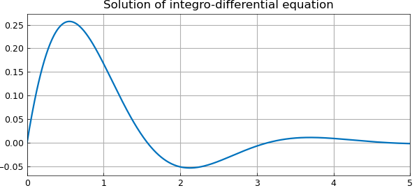

# Wikipedia integro-differential equation example

*Mark Richardson, September 2010*

[Original MATLAB Chebfun example](https://www.chebfun.org/examples/integro/WikiIntegroDiff.html)

Python translation: [`examples/integro/wiki_integro_diff.py`](https://github.com/ma-gilles/chebfunjax/blob/main/examples/integro/wiki_integro_diff.py)

Here, we solve a first order linear integro-differential equation considered in the Wikipedia article [1]:

$$ u'(x) + 2u(x) + 5\int_0^x u(t) dt = 1~ (x\ge 0), ~~ = 0~ (x<0) $$

with $u(0)=0$.

Begin by defining the domain $d$, chebfun variable $x$ and operator $N$.

```matlab
d = [0 5];
x = chebfun('x',d);
N = chebop(d);
```

The problem has a single Dirichlet boundary condition at $x=0$.

```matlab
N.lbc = 0;
```

Define the operator using Chebfun's overloaded `diff` and `cumsum` commands.

```matlab
N.op = @(u) diff(u) + 2*u + 5*cumsum(u);
```

Set the right-hand side of the integro-differential equation.

```matlab
rhs = 1;
```

Solve the IDE using backslash.

```matlab
u = N\rhs;
```

Here is the analytic solution:

```matlab
u_exact = 0.5*exp(-x)*sin(2*x);
```

How close is the computed solution to the true solution?

```matlab
accuracy = norm(u-u_exact)
```

```text
accuracy =
     3.827463008856287e-16
```

Plot the computed solution

```matlab
plot(u), grid on
title('Solution of integro-differential equation')
```



## References

1. [http://en.wikipedia.org/wiki/Integro-differential_equation](http://en.wikipedia.org/wiki/Integro-differential_equation)

---

*Translated with [chebfunjax](https://github.com/ma-gilles/chebfunjax); prose and MATLAB code from the original example, copyright The University of Oxford and The Chebfun Developers.  Printed outputs and figures are chebfunjax's.*
