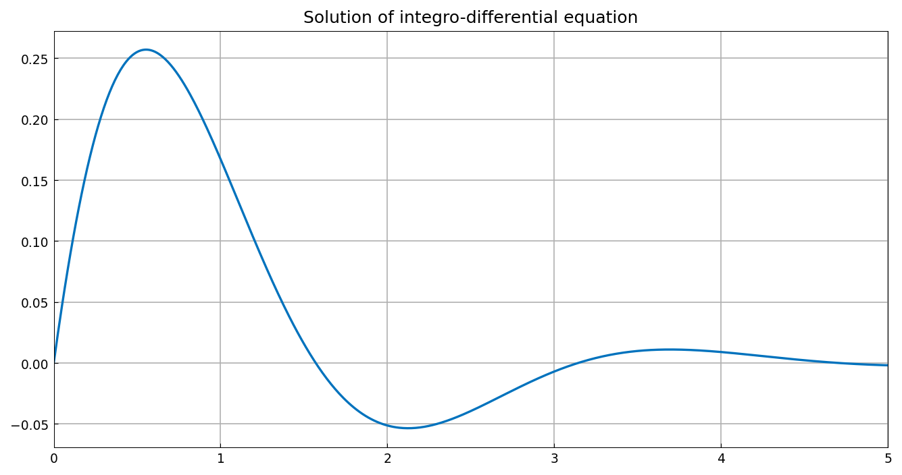

# Wikipedia integro-differential equation example

*Mark Richardson, September 2010*

[Original MATLAB Chebfun example](https://www.chebfun.org/examples/integro/WikiIntegroDiff.html)

(Chebfun example integro/WikiIntegroDiff.m)

Here, we solve a first order linear integro-differential equation
considered in the Wikipedia article [1]:

$$ u'(x) + 2u(x) + 5\int_0^x u(t)\,dt = 1~(x\ge 0), \qquad = 0~(x<0) $$

with $u(0)=0$. The problem has a single Dirichlet boundary condition at
$x=0$, and the operator is defined using Chebfun's overloaded `diff` and
`cumsum` commands:

```python
N = Chebop(lambda x, u: u.diff() + 2*u + 5*u.cumsum(), domain=(0, 5))
N.lbc = 0
u = N.solve(1.0)
```

The analytic solution is $u(x) = \frac{1}{2}e^{-x}\sin(2x)$. How close is
the computed solution to the true solution?

```text
accuracy =
     3.244328780466792e-16
```

(The published page shows `2.655275752894818e-16`; both are eps-level
norms of the same quantity, differing only in the last-digit rounding of
the linear-algebra path.)



## References

1. http://en.wikipedia.org/wiki/Integro-differential_equation

---

*Replica script: [`examples/integro/wiki_integro_diff_replica.py`](https://github.com/ma-gilles/chebfunjax/blob/main/examples/integro/wiki_integro_diff_replica.py).
Original example copyright by The University of Oxford and The Chebfun
Developers.*
