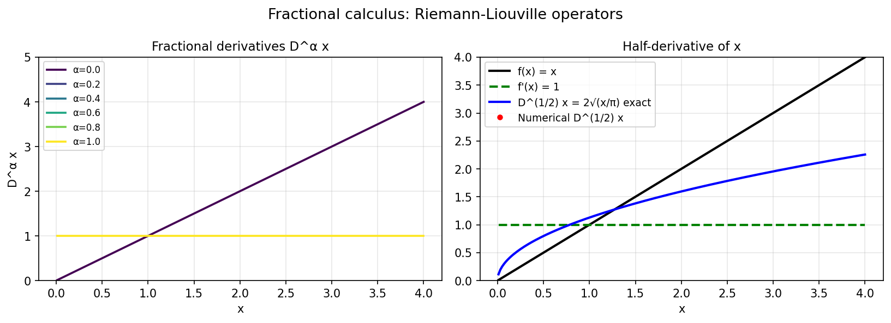

# Fractional Calculus

**Source:** `integro/FracCalc.m` — Nick Hale, October 2010
**Python:** `examples/integro/fractional_calculus.py`
**Original MATLAB:** https://www.chebfun.org/examples/integro/FracCalc.html

## Overview

Computes fractional integrals and derivatives `D^α f` for `0 < α < 1`
using the Riemann-Liouville definition.

## Riemann-Liouville fractional integral

```
(I^α f)(x) = 1/Γ(α) ∫₀ˣ (x - t)^{α-1} f(t) dt
```

For `f(x) = x^k`, the exact result is:
```
I^α x^k = Γ(k+1)/Γ(k+1+α) · x^{k+α}
```

## Fractional derivative

The fractional derivative `D^α f` of order `0 < α < 1` is defined as:
```
D^α f = D (I^{1-α} f)
```
i.e., first apply the `(1-α)` fractional integral, then differentiate once.

## Code excerpt

```python
from scipy.special import gamma
import numpy as np

def frac_integral(f_vals, x_vals, alpha):
    """Riemann-Liouville fractional integral of order alpha."""
    n = len(x_vals)
    result = np.zeros(n)
    for i in range(1, n):
        t_sub = x_vals[:i+1]
        f_sub = f_vals[:i+1]
        kernel = (x_vals[i] - t_sub) ** (alpha - 1)
        result[i] = np.trapezoid(kernel * f_sub, t_sub) / gamma(alpha)
    return result
```

## Plots



Fractional integrals of `x^k` for `k = 1, 2, 3, 4, 5` with `α = 0.5`,
compared to analytical results.
