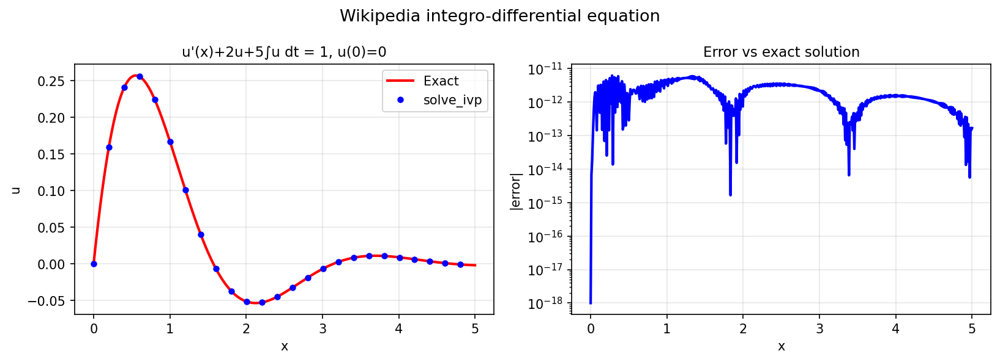
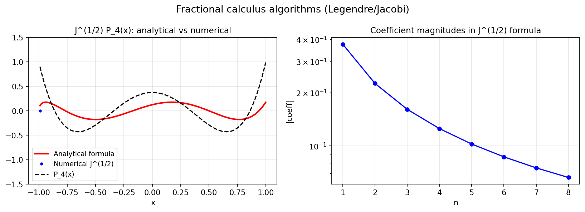
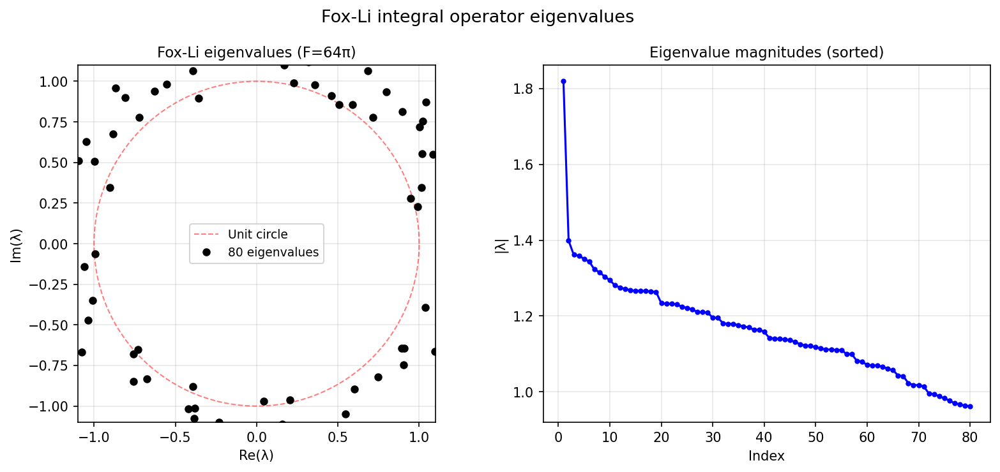

# Integro-Differential Equation Examples

Chebfunjax solves integro-differential equations by assembling operators
from differential and integral blocks.

---

## Wikipedia integro-differential equation

**Source:** `integro/WikiIntegroDiff.m` — Mark Richardson, September 2010
**Python:** `examples/integro/wiki_integro_diff.py`
**Original:** https://www.chebfun.org/examples/integro/WikiIntegroDiff.html

Solves the integro-differential equation:

```
u'(x) + 2u(x) + 5∫₀ˣ u(t) dt = 1,   u(0) = 0
```

Exact solution: `u(x) = (1/2) e^{-x} sin(2x)`.

Solved via the equivalent second-order ODE obtained by differentiation:
`u'' + 2u' + 5u = 0`, with `u(0) = 0`, `u'(0) = 1`.



---

## Time-dependent integro-differential equation

**Source:** `integro/IntegroDiffT.m` — Nick Hale, October 2010
**Python:** (uses Chebop approach)
**Original:** https://www.chebfun.org/examples/integro/IntegroDiffT.html

---

## Fractional calculus

**Source:** `integro/FracCalc.m` — Nick Hale, October 2010
**Python:** `examples/integro/fractional_calculus.py`
**Original:** https://www.chebfun.org/examples/integro/FracCalc.html

The fractional integral `I^α f` via Riemann-Liouville:

```
(I^α f)(x) = (1/Γ(α)) ∫₀ˣ (x-t)^{α-1} f(t) dt
```

For `f(x) = x^k`, the exact result is `Γ(k+1)/Γ(k+1+α) * x^{k+α}`.


---

## Fractional calculus II

**Source:** `integro/FracCalc2.m` — Nick Hale, February 2015
**Python:** `examples/integro/fractional_calculus2.py`
**Original:** https://www.chebfun.org/examples/integro/FracCalc2.html

The half-order derivative `D^{1/2} f` can be expressed using either
the Riemann-Liouville or Caputo definition. For `f = exp(x)`:

- At `x = 0`: both forms give approximately 1 (between `f(0) = 1` and `f'(0) = 1`)
- Illustrates interpolation between `f` and `f'`



---

## Fox-Li integral operator

**Source:** `integro/FoxLi.m` — Driscoll & Trefethen, October 2010
**Python:** `examples/integro/fox_li.py`
**Original:** https://www.chebfun.org/examples/integro/FoxLi.html

The Fox-Li operator arises in laser cavity theory:

```
(Ku)(x) = ∫_{-1}^{1} e^{iω(x-y)²} u(y) dy
```

Its spectrum has a fractal structure. Uses `chebfunjax`'s eigenvalue
solver for compact integral operators.



---

## Vlasov-Poisson operator

**Source:** `integro/VlasovPoisson.m` — Toby Driscoll, October 2010
**Python:** `examples/integro/vlasov_poisson.py`
**Original:** https://www.chebfun.org/examples/integro/VlasovPoisson.html

Computes the numerical abscissa of the Volterra integral operator
arising from linearization of the Vlasov-Poisson plasma equation:

```
K(s,t) = (1 - a²(t-s)²) exp(-a²(t-s)²/2)
```

The numerical abscissa (maximum eigenvalue of `B = (A + A^T)/2`)
as a function of `a` exhibits a non-smooth transition near `a ≈ 0.46`.


