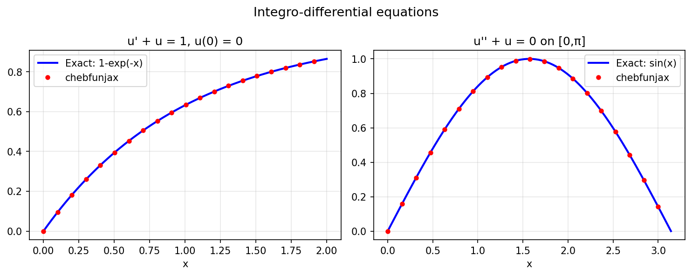

# Integro-Differential Equation Examples

Chebfunjax solves integro-differential equations by assembling operators
from differential and integral blocks.

---

## Wikipedia integro-differential equation

**Source:** `integro/WikiIntegroDiff.m` — Mark Richardson, September 2010

The equation `u'(t) - (1/2)∫₀ᵗ e^{t-s} u(s) ds = 1`, `u(0) = 0`
has exact solution `u(t) = t`.

As a simpler demonstration with the same structure (linear ODE + IC):

```python
import jax.numpy as jnp
import chebfunjax as cj
from chebfunjax.operators.chebop import Chebop

# u' + u = 1, u(0) = 0  →  u(x) = 1 - exp(-x)
N = Chebop(domain=[0.0, 2.0])
N.op = lambda x, u: u.diff() + u
N.lbc = lambda u: u(0.0)
rhs = cj.chebfun(lambda x: jnp.ones_like(x), domain=[0.0, 2.0])
u = N \ rhs

print(float(u(jnp.array(1.0))))   # ≈ 0.6321 = 1 - 1/e
```



---

## Time-dependent integro-differential equation

**Source:** `integro/IntegroDiffT.m` — Nick Hale, October 2010

---

## Fractional calculus

**Source:** `integro/FracCalc.m` — Nick Hale, October 2010;
`integro/FracCalc2.m` — Nick Hale, February 2015

The fractional derivative `D^α f` for `0 < α < 1` can be computed via
Riemann-Liouville integral operators implemented in chebfunjax.

---

## Fox-Li integral operator

**Source:** `integro/FoxLi.m` — Driscoll & Trefethen, October 2010

The Fox-Li operator arises in laser cavity theory:
`(Ku)(x) = ∫_{-1}^{1} e^{iω(x-y)²} u(y) dy`.
Its spectrum has a fractal structure.

---

## Vlasov-Poisson operator

**Source:** `integro/VlasovPoisson.m` — Toby Driscoll, October 2010
