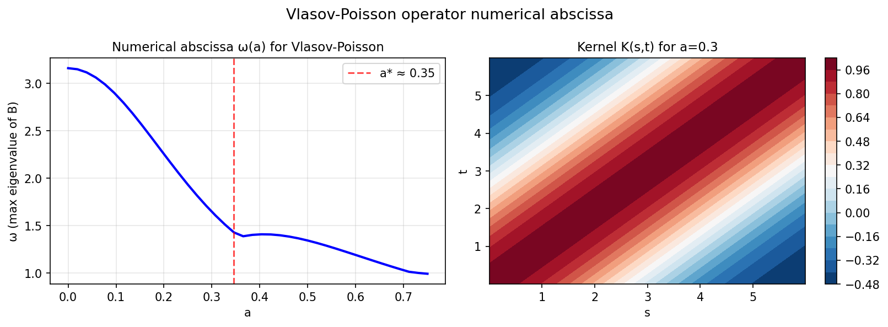

# Vlasov-Poisson Operator Numerical Abscissa

**Source:** `integro/VlasovPoisson.m` — Toby Driscoll, October 2010
**Python:** `examples/integro/vlasov_poisson.py`
**Original MATLAB:** https://www.chebfun.org/examples/integro/VlasovPoisson.html

## Overview

Computes the numerical abscissa (maximum real part of eigenvalues,
or equivalently, maximum eigenvalue of the symmetrized operator)
for the Volterra integral operator arising in linearized Vlasov-Poisson
plasma physics.

## Operator

The kernel is:
```
K(s, t) = (1 - a²(t-s)²) exp(-a²(t-s)²/2)
```

The Volterra operator `A` acts as:
```
(Au)(t) = ∫₀ᵗ K(s,t) u(s) ds
```

The **numerical abscissa** is the maximum eigenvalue of `B = (A + A^T)/2`.

## Discretization

Uses Gauss-Legendre quadrature on `[0, 6]` with 100 nodes.
The symmetrized matrix `B_disc` is built and its largest eigenvalue
is computed via `numpy.linalg.eigvalsh`.

## Results

The numerical abscissa `ω(a)` as a function of `a`:
- At `a = 0`: `K ≡ 1`, so `ω ≈ T/2 ≈ 3.16` (rank-1 operator)
- As `a` increases: kernel localizes, abscissa decreases
- A non-smooth kink near `a ≈ 0.35-0.46` (Chebfun finds `a* ≈ 0.46`)

## Plots



Left: numerical abscissa `ω(a)` for `a ∈ [0, 0.75]`.
Right: kernel contour plot at `a = 0.3`.
