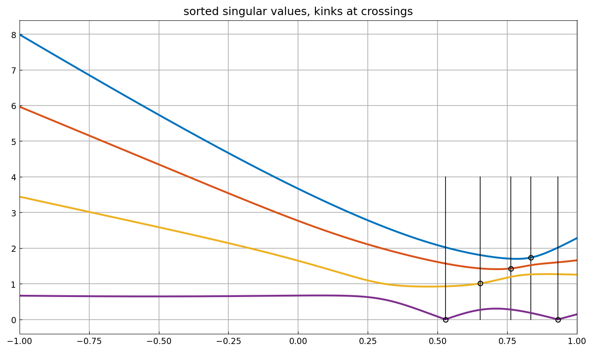
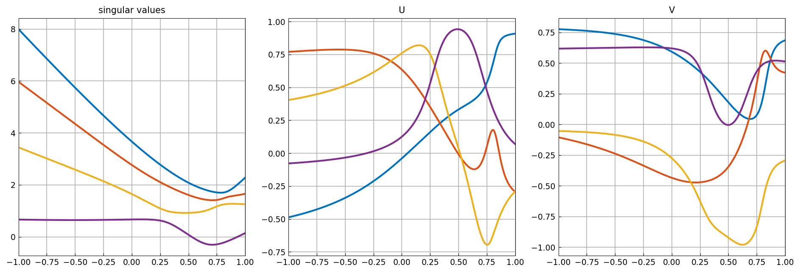

# The analytic SVD

*Yuji Nakatsukasa and Vanni Noferini, May 2016*

[Original MATLAB Chebfun example](https://www.chebfun.org/examples/linalg/AnalyticSVD.html)

(Chebfun example linalg/AnalyticSVD.m)

The singular values of an analytic matrix family
$A(t) = At + B(1-t)$ are *not* analytic functions of $t$ when kept
sorted: branches cross, and the sorted values have kinks.  Chebfuns
with splitting detect them:

The *analytic SVD* instead lets branches pass through each other, at
the price of singular values that may go negative.  Tracking each
branch through the crossings and flipping signs
($ (u, v, \sigma) \to (s_u u,\; s_v v,\; s_u s_v \sigma) $
preserves $A = \sum \sigma_k u_k v_k^*$) produces smooth singular
values and smooth singular-vector entries:

Note the branch that dips below zero — the signature of the analytic
SVD.  (`rng(10)` `randn` draws are not reproducible across systems,
so the crossing pattern is our own draw of the same family.)

---

*Replicated with [chebfunjax](https://github.com/ma-gilles/chebfunjax); original
example copyright The University of Oxford and The Chebfun Developers.*
