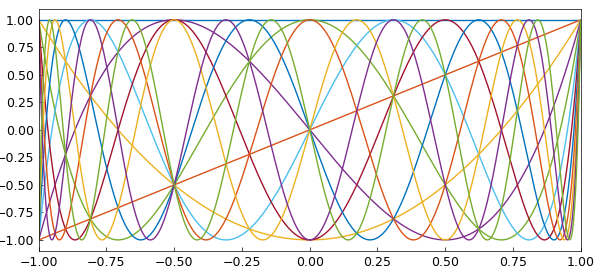
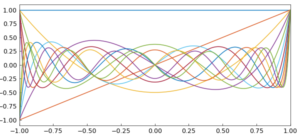
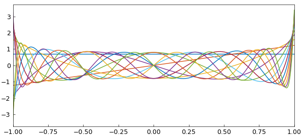
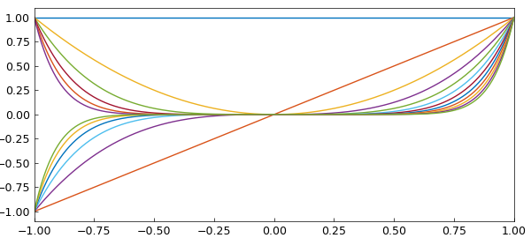

# Condition numbers of various bases

*Nick Trefethen, September 2010*

[Original MATLAB Chebfun example](https://www.chebfun.org/examples/linalg/CondNos.html)

Python translation: [`examples/linalg/cond_nos.py`](https://github.com/ma-gilles/chebfunjax/blob/main/examples/linalg/cond_nos.py)

[revised June 2019]

Chebfun can compute the condition number of a set of functions on an interval. That's a condition number for continuous functions, not discrete approximations.

For example, here we take the first $12$ Chebyshev polynomials on $[-1,1]$:

```matlab
N = 11;
A = chebpoly(0:N);
plot(A)
fprintf('Condition no. for Chebyshev polynomials: %8.3f\n',cond(A))
```

```text
Condition no. for Chebyshev polynomials:    4.006
```



Legendre polynomials are not much different:

```matlab
A = legpoly(0:N);
plot(A)
fprintf('Condition no. for Legendre polynomials: %8.3f\n',cond(A))
```

```text
Condition no. for Legendre polynomials:    4.796
```



Here are the Legendre polynomials normalized by having unit norm rather than by taking the value $1$ at $x=1$. Since the functions are orthonormal, the condition number is $1$.

```matlab
A = legpoly(0:N,'norm');
plot(A)
fprintf('Condition no. for normalized Legendre polynomials: %8.3f\n',cond(A))
```

```text
Condition no. for normalized Legendre polynomials:    1.000
```



All of these condition numbers are fine for numerical work. Monomials, by contrast, are exponentially ill-conditioned:

```matlab
x = chebfun('x');
A = x^(0:N);
plot(A)
fprintf('Condition no. for monomials: %8.3f\n',cond(A))
```

```text
Condition no. for monomials: 7244.534
```



Now what exactly do these condition numbers mean? Here is an explanation following Chapter 4 of [2]. $A$ is a "quasimatrix", a matrix with $12$ "columns" that are not vectors but functions of the variable $x$ on $[-1,1]$. This quasimatrix represents a mapping from the space $R^{12}$ of vectors of dimension $12$ into the $12$-dimensional subspace of degree $11$ polynomials in $L^2([-1,1])$, the infinite-dimensional space of square-integrable functions defined on $[-1,1]$. Now suppose we consider the unit ball in $R^{12}$, that is, the set of all $12$-vectors whose $2$-norm is $<1$. The quasimatrix $A$ maps this ball into an $12$-dimensional hyperellipsoid, a kind of $12$-dimensional pancake. The condition number $\mbox{cond}(A)$ is equal to the ratio of the largest dimension of the pancake to the smallest. When the columns of $A$ are monomials, the pancake is very flat indeed.

## References

1. L. N. Trefethen, Householder triangularization of a quasimatrix, *IMA Journal of Numerical Analysis*, 30 (2010), 887--897.
2. L. N. Trefethen and D. Bau, III, *Numerical Linear Algebra*, SIAM, 1997.

---

*Translated with [chebfunjax](https://github.com/ma-gilles/chebfunjax); prose and MATLAB code from the original example, copyright The University of Oxford and The Chebfun Developers.  Printed outputs and figures are chebfunjax's.*
