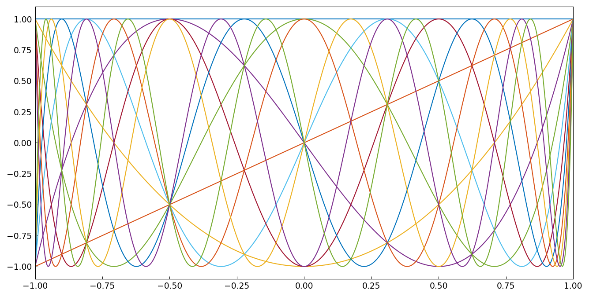
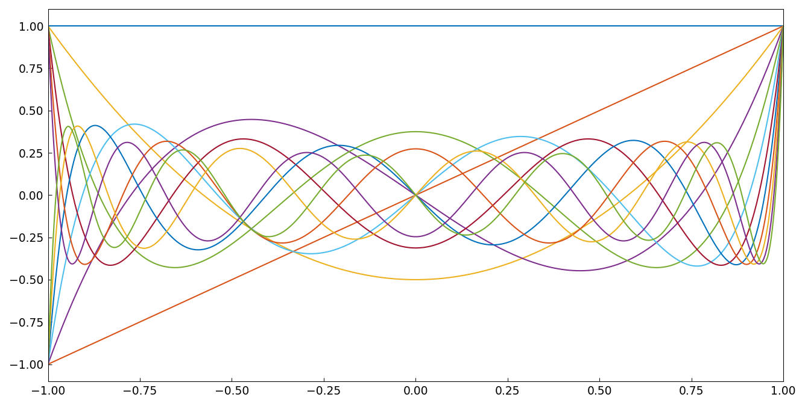
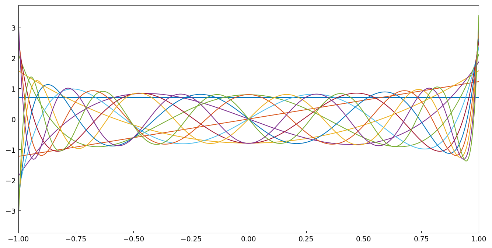
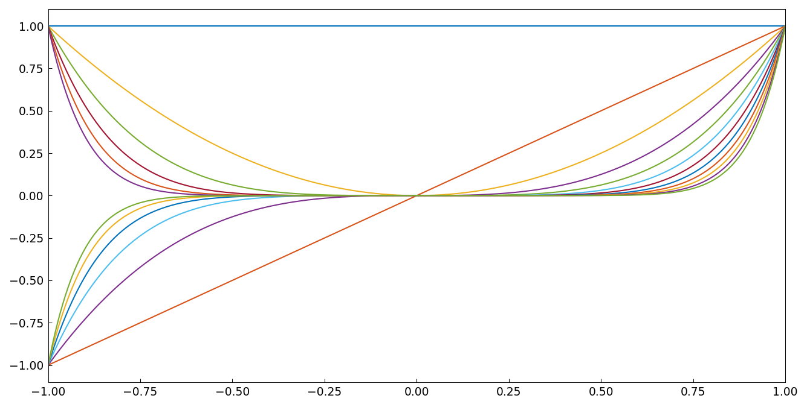

# Condition numbers of various bases

*Nick Trefethen, June 2011*

[Original MATLAB Chebfun example](https://www.chebfun.org/examples/linalg/CondNos.html)

(Chebfun example linalg/CondNos.m)

A quasimatrix is a "matrix" whose columns are functions, and its
condition number is the ratio of extreme singular values of the
continuous SVD.  For the quasimatrix of Chebyshev polynomials
$T_0,\dots,T_{11}$:



```text
Condition no. for Chebyshev polynomials:    4.006
```

Legendre polynomials are slightly worse:



```text
Condition no. for Legendre polynomials:    4.796
```

Normalized Legendre polynomials are orthonormal, hence perfectly
conditioned:



```text
Condition no. for normalized Legendre polynomials:    1.000
```

Monomials, by contrast, are exponentially ill-conditioned:



```text
Condition no. for monomials: 7244.534
```

(All four values digit-for-digit with the published MATLAB outputs.)

---

*Replicated with [chebfunjax](https://github.com/ma-gilles/chebfunjax); original
example copyright The University of Oxford and The Chebfun Developers.*
