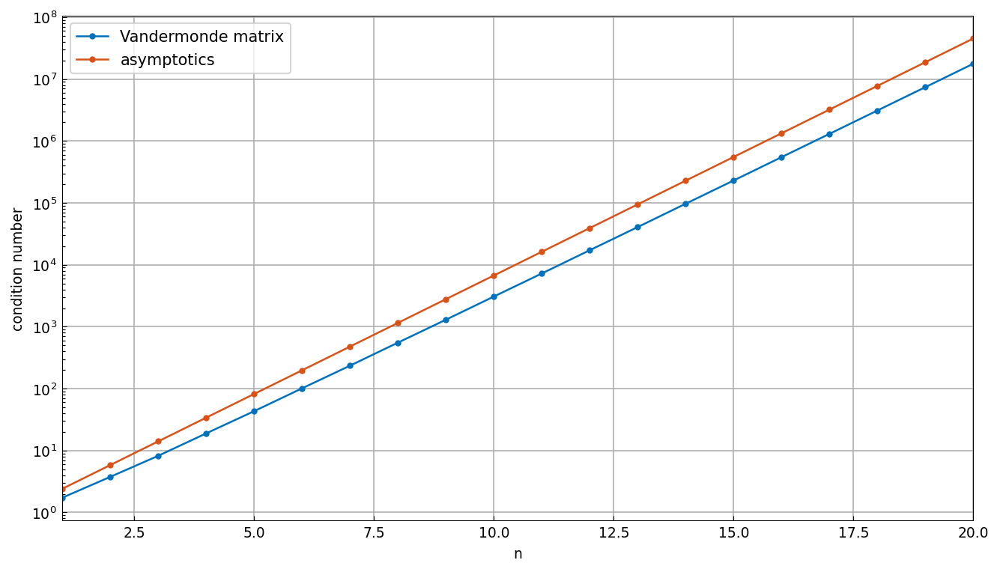

# Conditioning of the Vandermonde quasimatrix

*Nick Trefethen, June 2019*

[Original MATLAB Chebfun example](https://www.chebfun.org/examples/linalg/CondVandermonde.html)

(Chebfun example linalg/CondVandermonde.m)

The "Vandermonde quasimatrix" has columns $1, x, \dots, x^n$ on
$[-1,1]$.  Its condition number, from the continuous SVD:

```text
ans =
     3.072959852624560e+03
```

(MATLAB: 3.072959852624344e+03 — 12 digits.)  Sweeping $n$ from 1 to
20 shows exponential growth at the rate $(1+\sqrt{2})^n$ predicted
by the theory of Beckermann and others:



---

*Replicated with [chebfunjax](https://github.com/ma-gilles/chebfunjax); original
example copyright The University of Oxford and The Chebfun Developers.*
