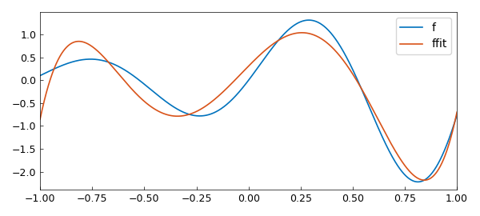
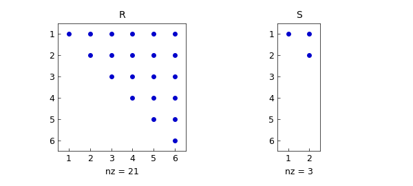
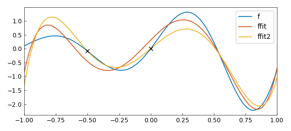
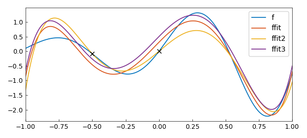
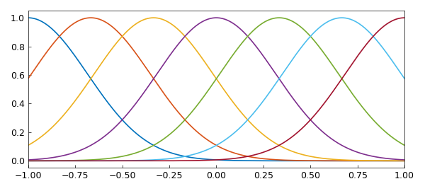
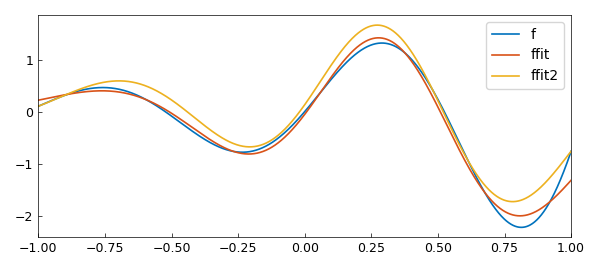

# The generalised QR factorisation and constrained least squares

*Nick Hale, March 2022*

[Original MATLAB Chebfun example](https://www.chebfun.org/examples/linalg/ConstrainedLeastSquares.html)

Python translation: [`examples/linalg/constrained_least_squares.py`](https://github.com/ma-gilles/chebfunjax/blob/main/examples/linalg/constrained_least_squares.py)

```matlab
function ConstrainedLeastSquares
```

## Least squares

Anyone who has taken a course in numerical analysis or linear algebra will be familiar with the least squares problem: given an $m\times n$ matrix $A$ with $m > n$ and an $m\times1$ vector $b$, find $x = {\rm argmin}||Ax-b||_2$. The problem is typically solved by forming a QR factorisation of $A$ (see, for example, [1, Part II]).

Chebfun has, since its early days, implemented the continuous analogue of this idea. That is, given an $\infty\times n$ quasimatrix $A$ and an $L^2$-integrable function $f$, find $c = {\rm argmin}||Ac-f||_2$, where the norm is now the $L^2$-norm. The method of solution is now based on a continuous QR factorisation, where $Q$ is a quasimatrix with orthonormal columns. More details can be found in [2] or in Chapter 6 in the Chebfun Guide [3], which contains the following example:

```matlab
x = chebfun('x');
A = x^(0:5);
f = exp(x)*sin(6*x);
c = A\f;
ffit = A*c;
clf, plot([f ffit])
legend('f', 'ffit')
```



## Equality-constrained least squares (LSE)

A natural extension to the least squares problem is a least squares problem with linear equality constraints, i.e., find $x = {\rm argmin}||Ax-b||_2$ subject to $Bx = d$, where $B$ is a $p\times m$ matrix, with $p<n<m+p$.

In the discrete setting, one way that such problems can be solved is by a generalised QR factorisation of the form $A^\top = QRU$, $B^\top = QS$, where $Q$ and $U$ are unitary matrices and $R$ and $S$ are upper-triangular. We omit the details, but refer the reader to [4] for a derivation. The following code computes a generalised QR factorisation via a QR factorisation of $B^\top$ followed by a rotated QR factorisation of $AQ$. (This is perhaps not the best way to compute the generalised QR factorisation, but we will see shortly that it allows us to make use of the existing Chebfun QR factorisation to compute the GQR factorisation in the continuous setting.)

```matlab
    function [Q, U, R, S] = gqr(A, B, flag)
    %GQR    Generalised QR factorisation.
    %   [Q, U, R, S] = GQR(A, B) produces a generalised QR factorisation of
    %   A and B such that A' = QRU and B' = QS, where Q and U are unitary,
    %   and R and S are upper triangular.
    %
    %   [___] = GQR(S,B,0) produces an economy-size decomposition of R & U.

    if ( isa(B, 'chebop') ), B = feval(B, A); end
    if ( nargin < 3 ), flag = {}; else, flag = {flag}; end

    [Q, S] = qr(B.');
    [U, R] = qr(flipud(fliplr(A*Q)), flag{:});  %#ok<FLUDLR>
    R = rot90(R.',2);
    U = flipud(fliplr(U.'));                    %#ok<FLUDLR>
    end
```

We demonstrate the factorisation with an example taken from [4]:

```matlab
A = [1 1 1 ; 1 3  1 ; 1 -1 1; 1 1 1];
B = [1 1 1 ; 1 1 -1];
format short
[Q, U, R, S] = gqr(A, B, 0)
```

```text
Q =
   -0.5774   -0.4082   -0.7071
   -0.5774   -0.4082    0.7071
   -0.5774    0.8165    0.0000
U =
   -0.5602    0.0809    0.0809   -0.8204
   -0.2000   -0.6928   -0.6928    0.0000
   -0.0000    0.7071   -0.7071         0
R =
    2.1112    2.7464   -1.6330
         0    0.0000   -1.1547
         0         0    2.0000
S =
   -1.7321   -0.5774
         0   -1.6330
         0         0
```

We validate the factorisation:

```matlab
I = eye(3);
err = norm(A.'-Q*R*U) + norm(B.'-Q*S) + norm(Q*Q'-I) + norm(U*U'-I)
```

```text
err =
   1.8025e-15
```

Now that we have the GQR factorisation, it is straightforward to solve the constrained least squares problem using the approach described in [4]. We implement this in lsqcon() below.

```matlab
    function x = lsqcon(A, b, B, d)
    %LSQCON    Constrained least squares.
    %   x = LSQCON(A, b, B, d) solves the constrained least squares problem
    %   min|Ax-b|_2 st Bx = d.

    [Q, U, R, S] = gqr(A, B, 0);
    [~,n] = size(A);  p = size(S,2);
    i1 = 1:p;         i2 = (p+1):n;
    y1 = S(i1,i1).'\d;
    y2 = R(i2,i2).'\(U(i2,:)*b-R(i1,i2).'*y1);
    x = Q*[y1 ; y2];

    end
```

Let's continue our example and choose the following right-hand sides:

```matlab
b = [1 2 3 4]';
d = [7 4]';
x = lsqcon(A, b, B, d)
```

```text
x =
    5.7500
   -0.2500
    1.5000
```

According to [4], the exact solution is given by

```matlab
sol = [46, -2, 12]'/8
```

```text
sol =
    5.7500
   -0.2500
    1.5000
```

We have matched these to around machine precision:

```matlab
err = norm(x - sol)
```

```text
err =
   1.1657e-15
```

## Continuous LSE

Like the QR factorisation, the generalised QR factorisation can be extended to the continuous setting, where $A$ and $U^\top$ are now column quasimatrices. Once we have the continuous generalised QR factorisation, the continuous constrained least squares problem is solved in the same way as its discrete counterpart. The codes gqr() and lsqcon() above are written to work in both the discrete and the continuous settings.

Below we see two examples, first where the equality constraints are interpolation conditions at $x = -0.5$ and $x = 0$, and then when the mean value of the fit on [-1, 1] is constrained to be zero.

```matlab
% Example 1
x = chebfun('x');
A = x^(0:5);
f = exp(x)*sin(6*x);
z = [-.5 ; 0];
B = feval(A, z); d = f(z);
[Q, U, R, S] = gqr(A, B, 0);
```

Validation:

```matlab
err = norm(A'-Q*R*U) + norm(B'-Q*S) + norm(Q*Q'-eye(6)) + norm(U*U'-eye(6))
subplot(1,2,1), spy(R), title('R'), subplot(1,2,2), spy(S), title('S')
```

```text
err =
   2.5263e-15
```



```matlab
% Solve the constrained least squares problem:
c = lsqcon(A, f, B, d);
ffit2 = A*c;

% Plot and compare with the unconstrained least squares solution:
clf, plot([f, ffit, ffit2], '-', z, f(z), 'xk');
legend('f' ,'ffit', 'ffit2')
```



We now impose that the least squares solution must have zero mean on [-1,1]. Since, in the continuous setting, the constraint $Bc = d$ will typically be formed from some functional applied to the resulting chebfun, ffit = Ac, lsqcon() allows $B$ to be passed as a chebop representing this functional.

```matlab
% Example 2:
B = chebop(@(u) sum(u)); d = 0;

% Solve constrained least squares problem:
c = lsqcon(A, f, B, d);
ffit3 = A*c;

% Validate the integral constraint:
err = sum(ffit3)
```

```text
err =
   4.0502e-16
```

```matlab
% Plot and compare with the unconstrained least squares solution:
hold on, plot(ffit3); hold off
legend('f' ,'ffit', 'ffit2', '', 'ffit3')
```



As with the unconstrained least squares problems, there is no need for the columns of $A$ to simply be powers of $x$ (or even polynomials). Here we consider one final example where the columns of $A$ are composed of shifted gaussians. For the constraint, we choose to impose that the fit interpolates at both $x = -1$ and $x = 1$, and has mean zero on [-1 1].

```matlab
% Example 3:
A = exp(-5*(x-(-3:3)/3).^2);
plot(A)
```



Solve unconstrained least squares problems:

```matlab
c1 = A\f;
ffit = A*c1;
```

Solve constrained least squares problem:

```matlab
B = chebop(@(u) [u([-1;1]) ; sum(u)]); d = [f([-1;1]) ; 0];
c2 = lsqcon(A, f, B, d);
ffit2 = A*c2;

% Validate the constraints:
err = sqrt(sum(ffit2).^2 + sum(f([-1;1]) - ffit2([-1;1])).^2)
```

```text
err =
   3.8287e-15
```

```matlab
% Plot and compare the solutions:
plot(f, '-', ffit, '-', ffit2, '-');
legend('f', 'ffit', 'ffit2')
```



## Alternatives

The GQR approach used above is one example of "null space" methods for solving the LSE problem. An alternative, also built on QR factorisations, is "elimination" methods. The basic difference is whether one first computes a QR factorisation of $B^\top$ or of $B$. For completeness, we include below an implementation using an elimination method, as described in [5, Section 20.9].

```matlab
    function x = lsqcone(A, b, B, d)
    %LSQCONE    Constrained least squares via elimination.
    %   x = LSQCONE(A, b, B, d) solves the constrained least squares problem
    %   min|Ax-b|_2 st Bx = d.

    if ( isa(B, 'chebop') ), B = feval(B, A); end

    [Q, R, P] = qr(B, 0);
    [~,n] = size(A);  p = size(B,1);
    i1 = 1:p;         i2 = (p+1):n;
    j1 = P(i1);       j2 = P(i2);
    R1 = R(:,i1);     R2 = R(:,i2);
    A1 = A(:,j1);     A2 = A(:,j2);
    AA = A2 - A1*(R1\R2);
    c = Q'*d;
    bb = b - A1*(R1\c);
    y2 = AA\bb;
    y1 = R1\(c - R2*y2);
    x = zeros(n,1);
    x(P) = [y1 ; y2];

    end
```

We repeat Example 3 using this method, and find it in agreement:

```matlab
c3 = lsqcone(A, f, B, d);
err = norm(c2 - c3)
```

```text
err =
   5.4113e-14
```

## References

[1] L. N. Trefethen and D. Bau, III, *Numerical Linear Algebra*. SIAM, 1997.

[2] A. Townsend and L. N. Trefethen, Continuous analogues of matrix factorizations. *Proceedings of the Royal Society A*, 2015.

[3] [https://www.chebfun.org/docs/guide/guide06.html](https://www.chebfun.org/docs/guide/guide06.html).

[4] E. Anderson, Z. Bai, and J. Dongarra, Generalized QR factorization and its applications. *Linear Algebra and its Applications*, 1992.

[5] N. J. Higham, *Accuracy and Stability of Numerical Algorithms*. SIAM, 2002.

```matlab
end
```

```text

```

---

*Translated with [chebfunjax](https://github.com/ma-gilles/chebfunjax); prose and MATLAB code from the original example, copyright The University of Oxford and The Chebfun Developers.  Printed outputs and figures are chebfunjax's.*
