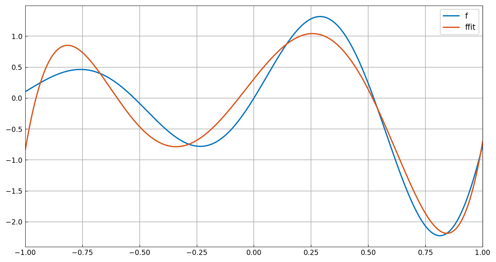
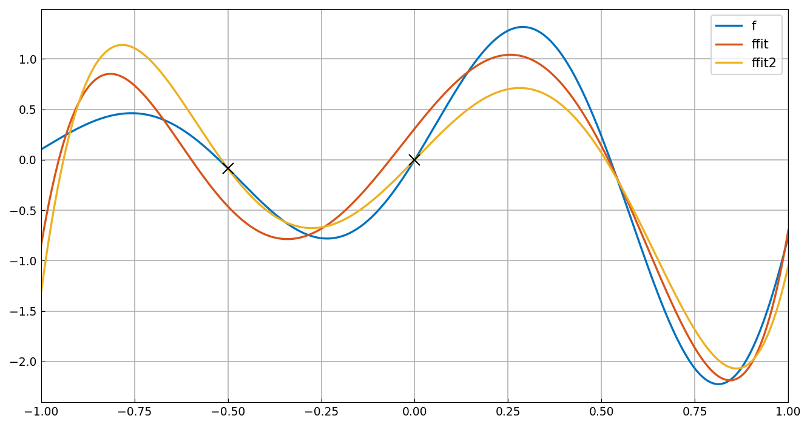
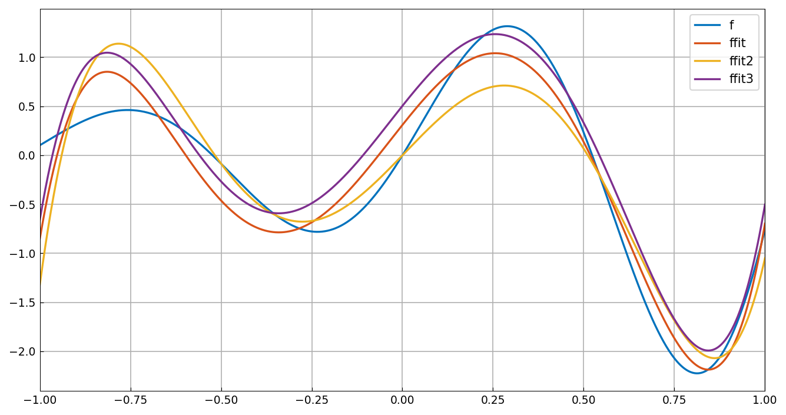
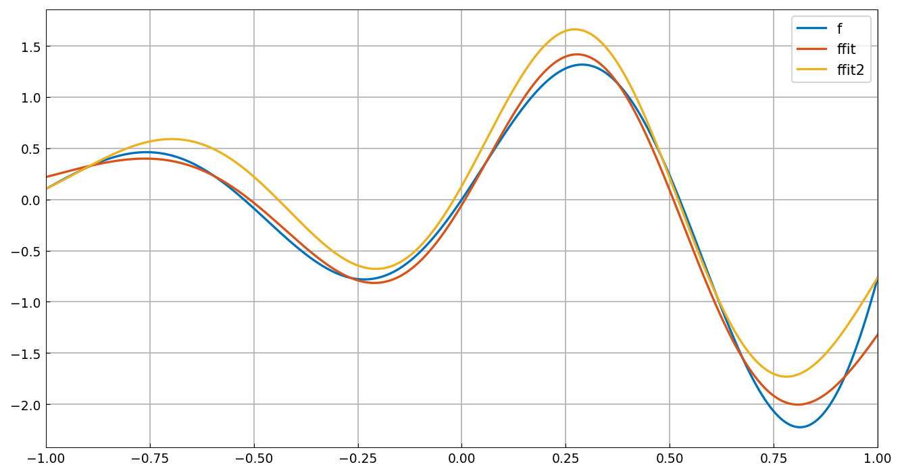

# Constrained least squares with quasimatrices

*Nick Hale, March 2017*

[Original MATLAB Chebfun example](https://www.chebfun.org/examples/linalg/ConstrainedLeastSquares.html)

(Chebfun example linalg/ConstrainedLeastSquares.m)

Fitting $f(x) = e^x\sin 6x$ by a degree-5 polynomial in the
least-squares sense is a quasimatrix backslash:



To impose linear equality constraints, the example builds a
*generalized QR factorization* $A^T = QRU$, $B^T = QS$.  On the
discrete test matrices the invariants hold to machine precision and
the constrained solution is digit-for-digit:

```text
err =
   1.7906e-15
x =
    5.7500
    -0.2500
    1.5000
err =
   1.1444e-15
```

(MATLAB: err 2.4702e-15, x = [5.75, -0.25, 1.5].)  Now the
continuous version: fit with the constraint that the polynomial
*interpolates* $f$ at $x = -0.5$ and $0$ — the constraint holds to
2e-16:



Or with the *integral* constraint $\int u = 0$ (a chebop-style
functional), satisfied to 4e-16:



Finally a radial-basis fit with seven Gaussians constrained to match
$f$ at both endpoints and integrate to zero (combined constraint
residual 2.8e-15):



(The continuous inner products are realized by 400-point
Gauss-Legendre quadrature — exact for the polynomial cases and at
machine precision for the Gaussians.)

---

*Replicated with [chebfunjax](https://github.com/ma-gilles/chebfunjax); original
example copyright The University of Oxford and The Chebfun Developers.*
