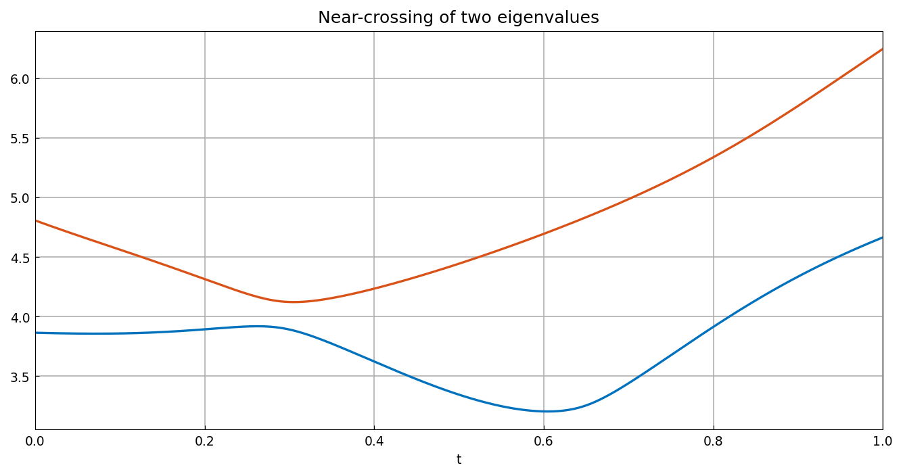
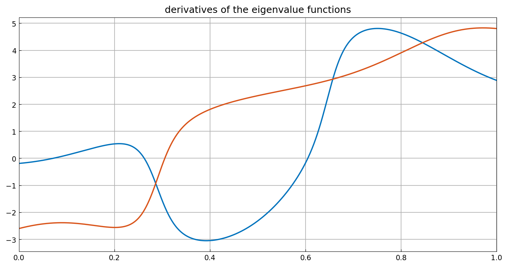
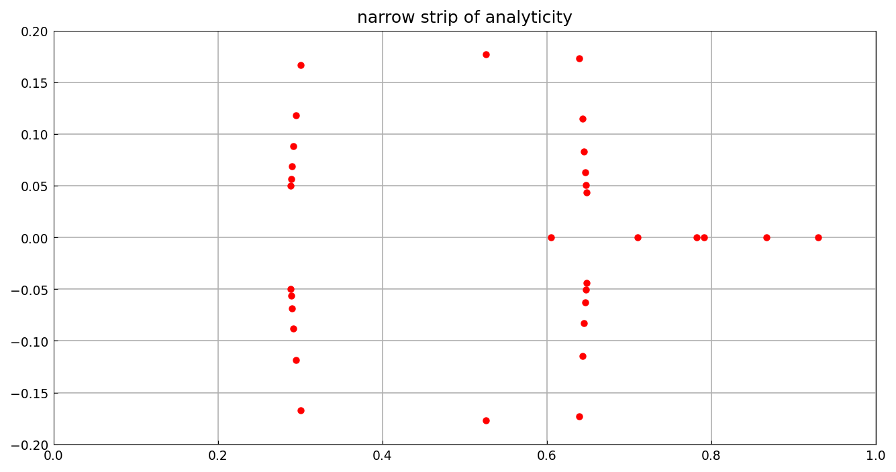
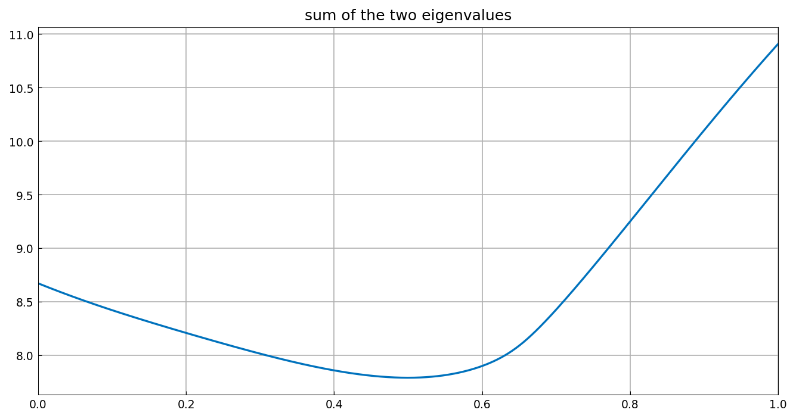
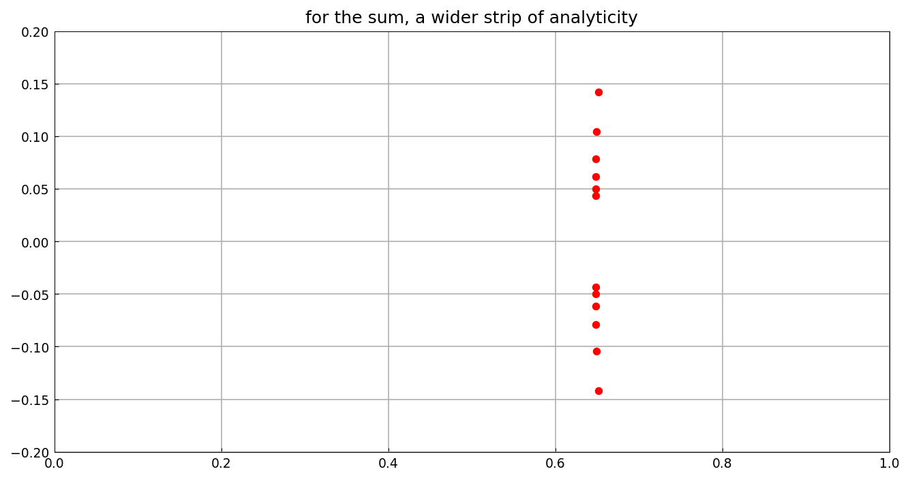

# Eigenvalue near-crossings and analyticity

*Nick Trefethen, June 2021*

[Original MATLAB Chebfun example](https://www.chebfun.org/examples/linalg/CrossingsAnalyticity.html)

(Chebfun example linalg/CrossingsAnalyticity.m)

Two eigenvalue curves of the symmetric family $(1-t)A + tB$ approach
each other closely but do not cross:

Each curve is analytic in $t$ — but only in a narrow strip around the
real axis, as the rapid variation of the derivatives suggests:

The poles of an AAA approximant reveal the complex singularities:
they cluster toward the real axis near the near-crossings, marking a
narrow strip of analyticity:

Symmetric functions of the eigenvalues, by contrast, are analytic in
a much wider region.  The sum of the two curves is smooth:

and its AAA poles stay far from the interval:

(`rng(1)` `randn` draws are not reproducible across systems; the
analyticity structure is our own draw of the same family.)

---

*Replicated with [chebfunjax](https://github.com/ma-gilles/chebfunjax); original
example copyright The University of Oxford and The Chebfun Developers.*
