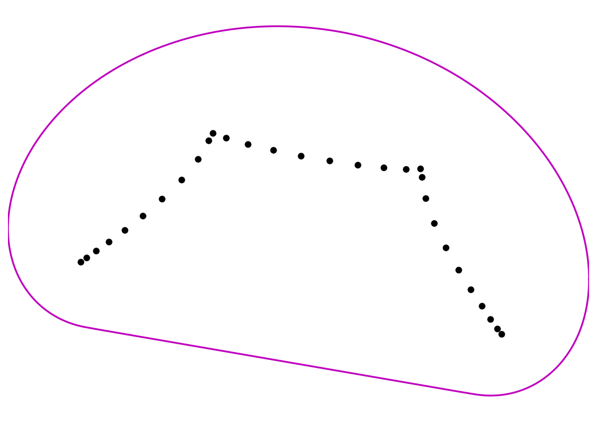

# Crouzeix's conjecture

*Nick Trefethen, August 2017*

[Original MATLAB Chebfun example](https://www.chebfun.org/examples/linalg/Crouzeix.html)

(Chebfun example linalg/Crouzeix.m)

Crouzeix's conjecture asserts that for any matrix $A$ and polynomial
$p$,

$$ \|p(A)\| \le 2 \max_{z \in W(A)} |p(z)|, $$

where $W(A)$ is the field of values.  (Crouzeix and Palencia proved
the bound with constant $1+\sqrt{2}$.)  Here is the field of values
and spectrum of a rotated Grcar matrix:



The *Crouzeix ratio* $\|p(A)\| / \max_{W(A)}|p|$ is computed with a
chebfun of the boundary curve.  For the 2x2 Jordan block with
$p(z) = z$, the ratio achieves the conjectured bound exactly:

```text
ans =
   2.000000000000000
```

For a random matrix and random quartic (our own `randn` draw;
MATLAB's gives 1.1918 — both comfortably below 2):

```text
ans =
   0.975514906758401
```

And for a *normal* matrix the ratio is exactly 1:

```text
ans =
   1.000000000000000
```

(The first and third values are digit-for-digit with MATLAB.)

---

*Replicated with [chebfunjax](https://github.com/ma-gilles/chebfunjax); original
example copyright The University of Oxford and The Chebfun Developers.*
