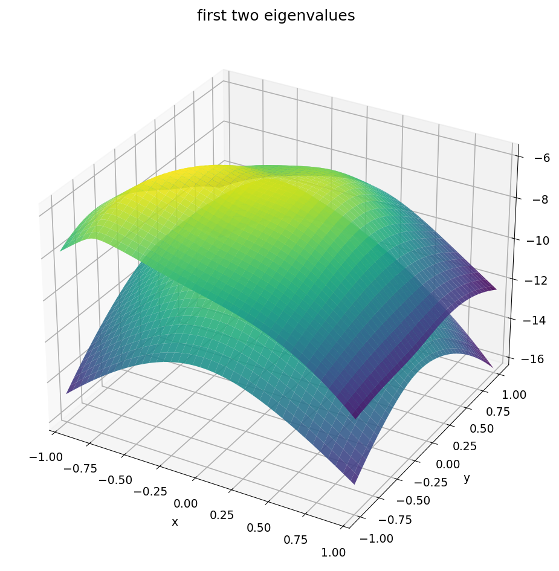
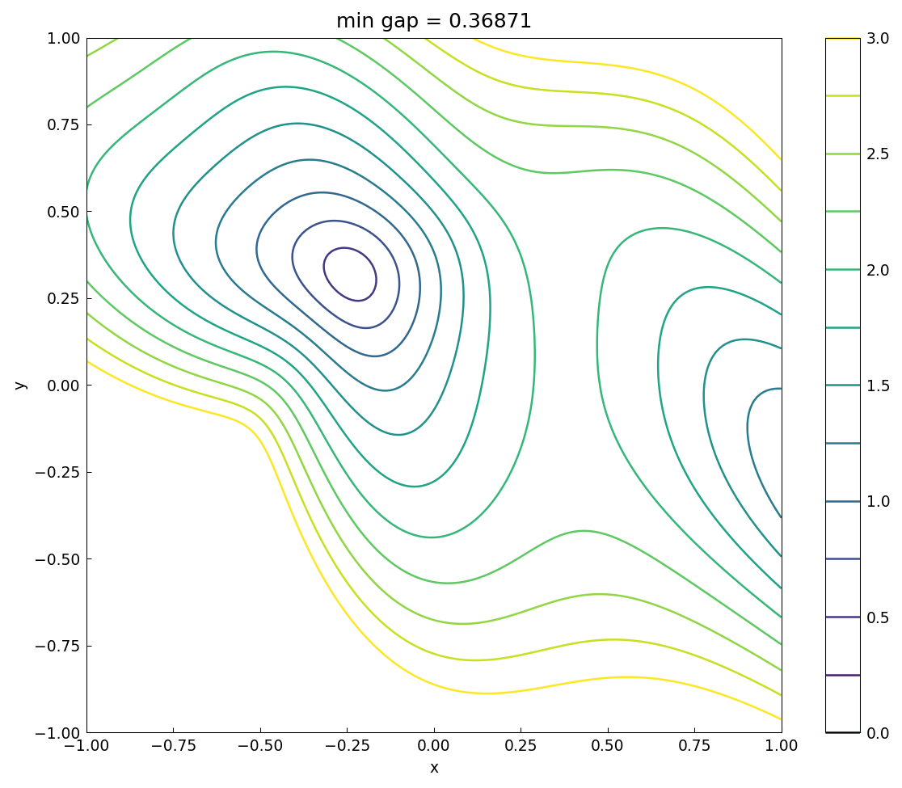
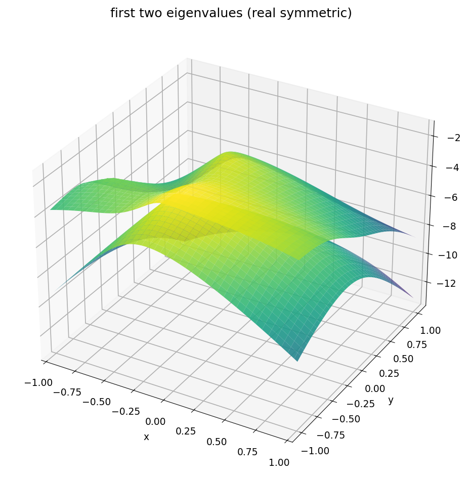
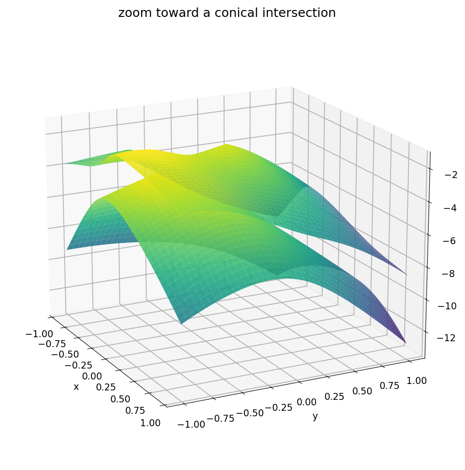

# Eigenvalue landscapes

*Nick Trefethen, June 2016*

[Original MATLAB Chebfun example](https://www.chebfun.org/examples/linalg/EigLandscapes.html)

(Chebfun example linalg/EigLandscapes.m)

Consider the two-parameter Hermitian family $B + xC + yD$ and its
sorted eigenvalues as functions of $(x,y)$.  For *complex* Hermitian
matrices, eigenvalue crossings have codimension 3, so generically the
surfaces are smooth and adaptive chebfun2 construction works
directly:



The gap between the first two eigenvalues never closes; its contour
plot and chebfun2 minimum:



For *real symmetric* matrices, crossings have codimension 2 — points
in the $(x,y)$ plane — and the surfaces develop conical kinks, which
adaptive construction cannot resolve; fixed 512-point grids are used
instead, exactly as in the MATLAB example:

```python
f1 = chebfun2(eig_op(0), n=512)
```



Zooming toward one of the conical intersections:



(All matrices are our own `randn` draws — streams are not
reproducible across systems; the geometry is what replicates.)

---

*Replicated with [chebfunjax](https://github.com/ma-gilles/chebfunjax); original
example copyright The University of Oxford and The Chebfun Developers.*
